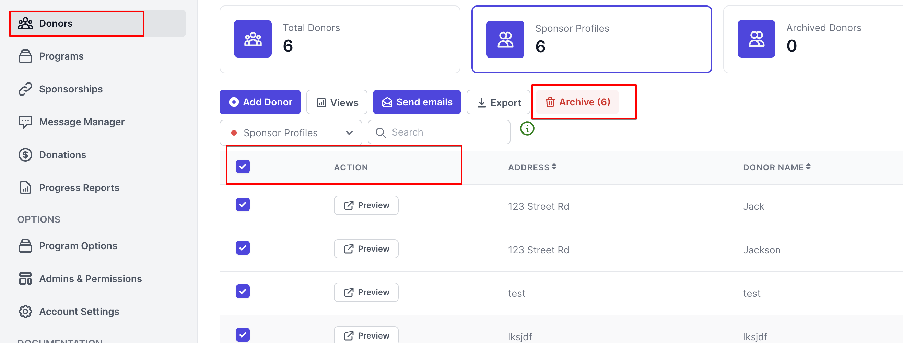
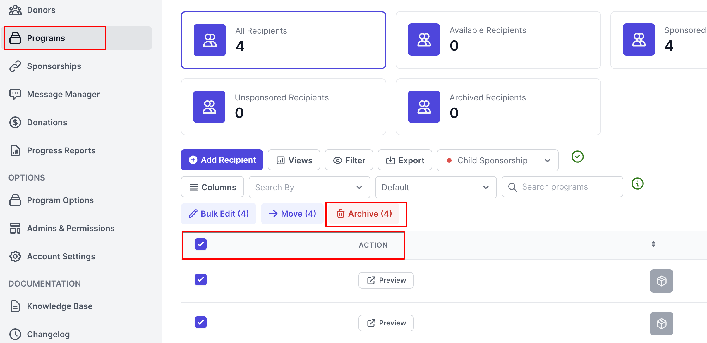
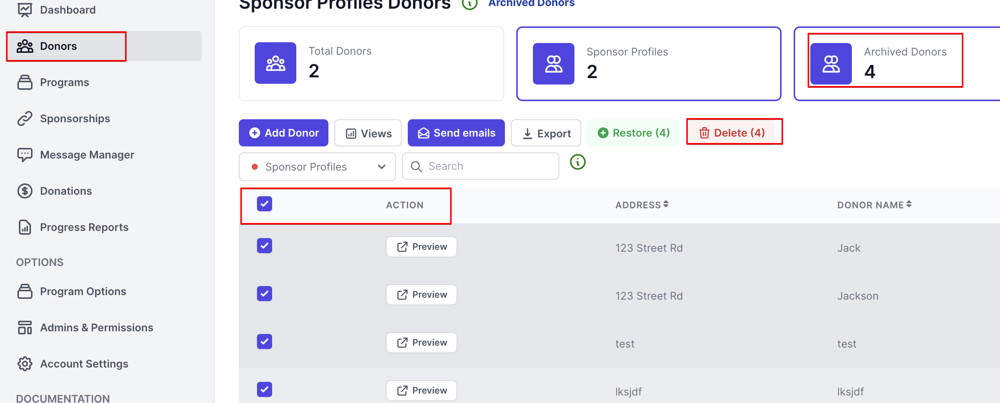
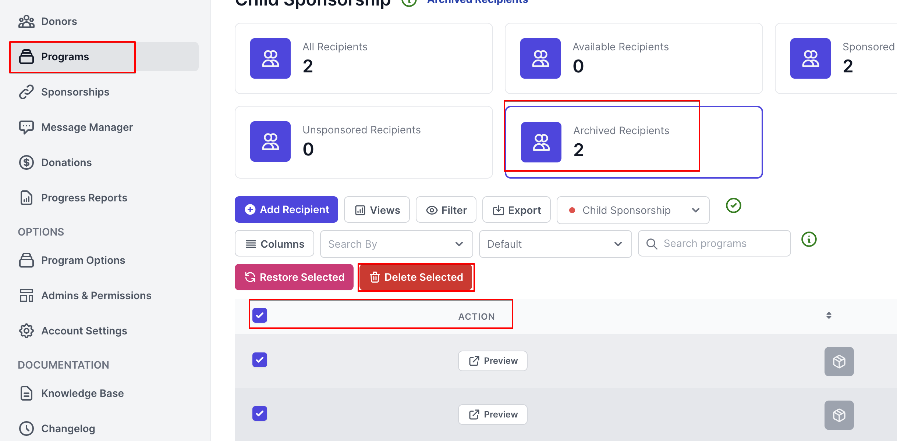

# Close Account

**Archive all donors, recipients and sponsorships, then proceed to delete all donors, recipients and sponsorships.**

1. **Archive all donors**

Select Donors in the side menu, Click the tick box next to the Action header then Archive.

<figure><figcaption></figcaption></figure>

2. **Archive all recipients**

Select Programs in the side menu, choose the recipient's program, Click the tick box next to the Action header then Archive.

<figure><figcaption></figcaption></figure>

3. **Delete all donors**

Select Donors in the side menu,Click the Archived Donors tab then tick the box next to the Action header then Delete.

<figure><figcaption></figcaption></figure>

4. **Delete all recipients**

Select Programs in the side menu, choose the recipient's program, Click the Archived Recipients then tick the box next to the Action header then Delete.

<figure><figcaption></figcaption></figure>
