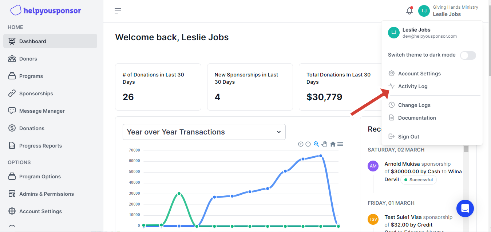

# Activity Log

To navigate to the Activity Log page, one must click the account dropdown via the top bar to reveal the option for the activity log.

<figure><figcaption>
Account dropdown options 
</figcaption></figure>

Once the "Activity Log" option is clicked, this action will navigate us to the activity log page, as illustrated below.

<figure><figcaption>
Activity Log page
</figcaption></figure>

The Activity Log page consists of various activities that are grouped by date. Each activity is logged with specific information and the time at which it was triggered. Each particular activity has a unique format for the message, and the most important information is always highlighted. For example, if a message is sent from a particular donor, the message will be displayed in the logs with the ability to navigate to that specific donor.\
\
The logs can be filtered for ease of navigation, especially when they are numerous and difficult to sift through. They are organized into categories corresponding to the types of actions triggered. For instance, if one wishes to filter by the action "Added Sponsorships," this can be done under the "Commitments" category. Filtering is accomplished by selecting the desired action within its category, as depicted below.

<figure><figcaption></figcaption></figure>
