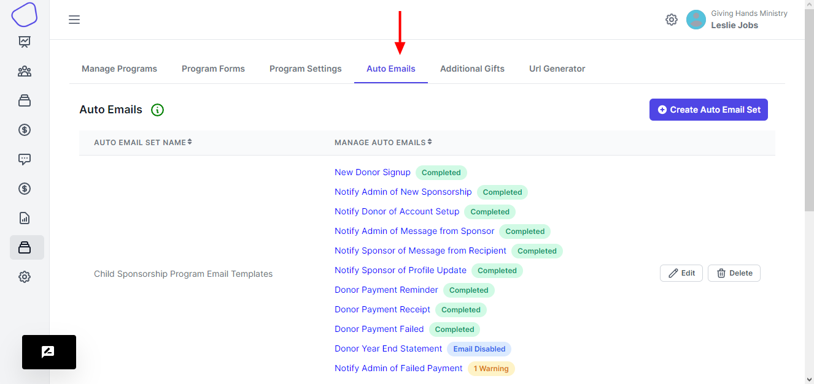
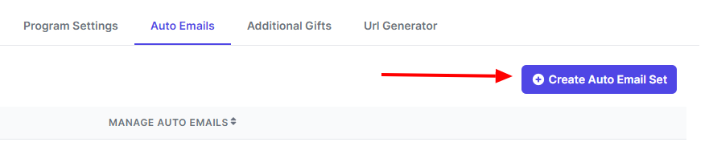
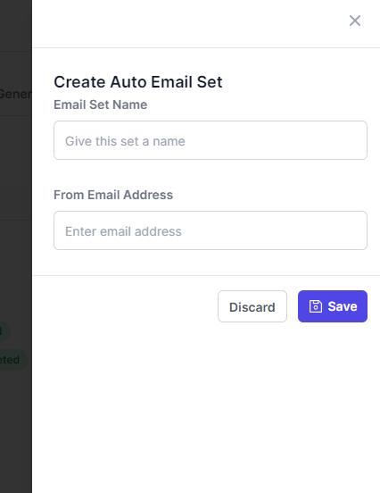
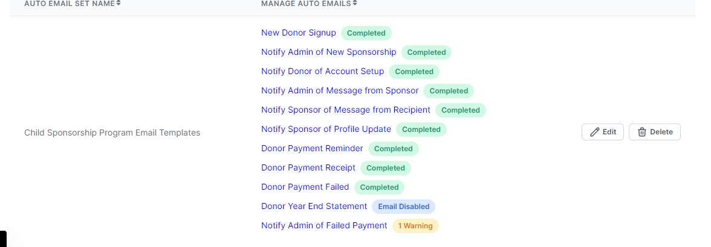
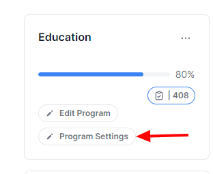
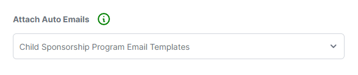
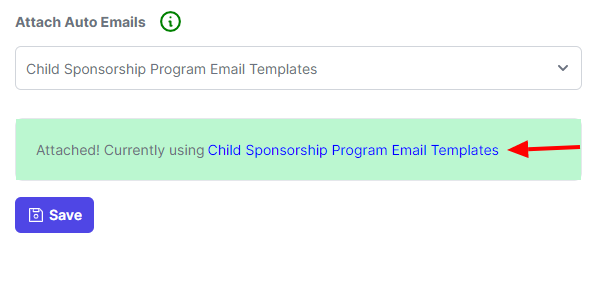
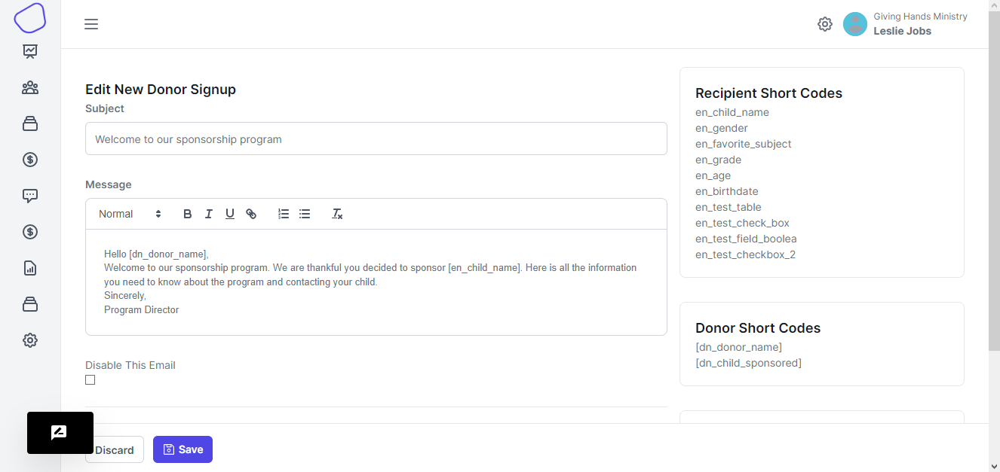

# Email Templates

In order to configure your Email Templates, first click here:

<figure><figcaption></figcaption></figure>

Then Click here:&#x20;

<figure><figcaption></figcaption></figure>

Next add an appropriate name and email address (This is the email that donors and admins will receive emails from and reply to) like this:

<figure><figcaption></figcaption></figure>

> **Note: If you don't input a valid email address, the email templates will not send!**

Click Save and your email templates will be created. Here's what they look like:

<figure><figcaption></figcaption></figure>

### Attach Templates to a Program

You will now need to attach the email templates to your program. Click here:

<figure><figcaption></figcaption></figure>

Scroll down to "Attach Email Templates Set," select your template and click Save like this:

<figure><figcaption></figcaption></figure>

To verify that your changes took, scroll down to "Attach Email Templates Set" and look to see that the area circled in red has your email template name:

<figure><figcaption></figcaption></figure>

Configuring Email Templates

Now, you can begin setting up your email templates. Click on&#x20;

<figure><figcaption></figcaption></figure>

Then, Click on "New Donor Signup"\

You can then create a custom email that new donors will receive upon signup. Here is an example of what you can write:

<figure><figcaption></figcaption></figure>

The fields on the right hand side of the screen are Short Codes. These give you access to the fields that you have created for both the Donors and the children, or other entities that you have setup in the Sponsorship Profile.&#x20;

The Additional Short Codes pertain to the sponsorship transaction.&#x20;

This email template is now fully configured.

#### Disabling Email Templates

If you would like to disable any of these email templates from sending, simply click here:

<figure><figcaption></figcaption></figure>

Then Click "Save." You This will disable the individual email template you are currently looking at. If you want to disable multiple templates, you must do this for each of them individually.
