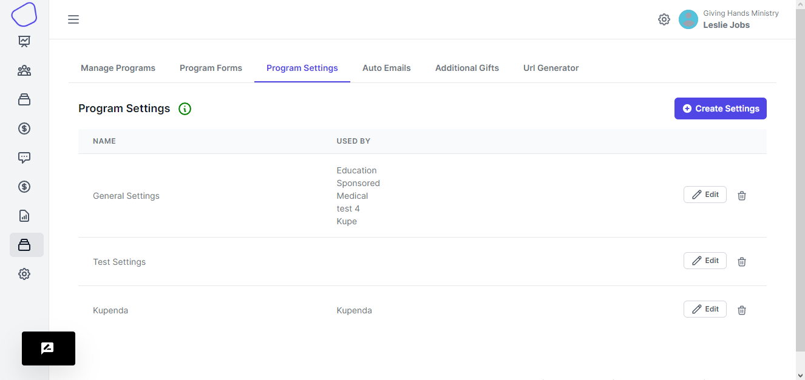
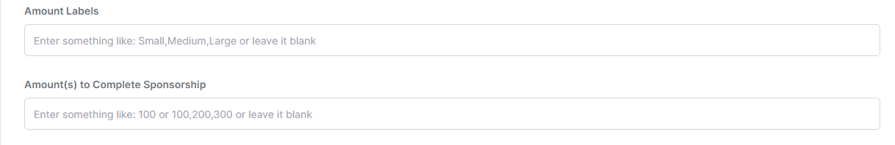
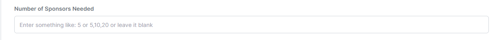
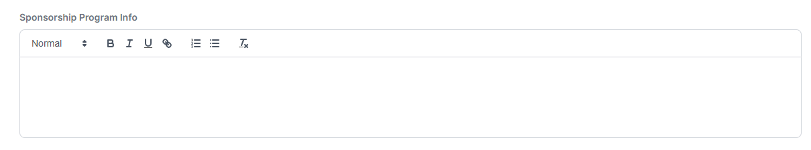

# Settings

Settings control how your sponsorship program functions. This is where you set the number of sponsors per child, the cost of sponsorship, and many other variables.

Within the HelpYouSponsor software you have run many different sponsorship programs. The settings are independent of your sponsorship programs. So you may use one set of settings for multiple programs or you may create a separate set of settings for each program. Because of this the software is incredibly flexible.

<figure><figcaption></figcaption></figure>

To add a new set of settings click the Add Settings button. To edit an existing set click the name of the settings you would like to edit. The "Used By" column indicates which programs are using a particular settings set. This is helpful for when you have several sets and need to edit a particular set.

#### Descriptions

Following are descriptions of each portion of the settings set.

Form Name:

This is the name you give the set so that it is easily identifiable.

Choose Program Type:

The software supports two types of sponsorship programs that we call Number of Sponsors or Contribution.&#x20;

* Number of Sponsors - This program type is for programs that require a certain number of sponsors for a child to be fully sponsored. If you require 1,2 or more sponsors per child then you would choose this program type.
* Contribution - This program type is for programs that require a certain contribution threshold to be met before a child is fully sponsored. For example, a sponsorship program could require a contribution threshold of $100 per month and so sponsors will continue to be accepted until that level has been met. One child may have one sponsor at $100 a month while another has 3 sponsors at $25 a month, 2 at $10 a month, and one at $5 a month.

Depending on which program type you choose will determine the next option.&#x20;

For contribution programs you will see the following options:

<figure><figcaption></figcaption></figure>

These fields allow you to specify the sponsorship threshold and even name the sponsorship levels if you like (names are not required). For example, if you have the following sponsorship levels: $50 Gold Sponsor, $25 Silver Sponsor, and $10 Bronze Sponsor, you would enter Gold Sponsor, Silver Sponsor, Bronze Sponsor in the second box. In the Sponsorship Amounts box (see below) you would enter 50,25,10. These will then be displayed as options to new sponsors when they are signing up for sponsorship.

For Number of Sponsors type program you will see the following option:

<figure><figcaption></figcaption></figure>

Simply enter the number of sponsors required. If you want to give admins the option of choosing the number of sponsors you can enter multiple numbers (i.e. 1,2,3). In the child's account profile the number of sponsors will display.

Sponsorship Amounts:

This can be one value or multiple values if you want multiple options. Only enter numbers (no currency symbols). If entering multiple numbers you will separate the numbers with a comma but no space.

Currency Symbol:

Enter the currency symbol you would like the software to use.

Length of sponsorship:

For perpetual sponsorship, sponsorships with no specified end date, leave this field blank. However, if you are creating a sponsorship program with a specific end date (maybe you are sponsoring a well drilling project or a fun run fundraiser) then you can enter the date the sponsorship program ends. Sponsors will not be charged for sponsorship after this date. You may enter a specific date or a number of days the sponsorship should last. For a three month sponsorship you would enter 90 for ninety days.

_The next section is a series of checkboxes that turn certain features on or off within in the software:_

<figure><figcaption></figcaption></figure>

Here is an explanation of each one:

* Allow sponsors to send email through their account - this allows sponsors to send emails through the software to their sponsor child when logged in to their account.\

* Show donation history in the donor/sponsor account - if you track donations in the software you can allow donors to view their donation history when logged in to their account.\

* Display designations on checkout page - you can create additional donation designations that display on the page when a donor is checking out. You can choose have this section display or not. For more information see the designations section on this site.\

* Allow users to login on the checkout page - when signing up for sponsorship there is a form for logging in and a form for creating a new account. You can remove the login form by unchecking this box.\

* Use Stripe - Stripe is the credit card payment gateway. As long as you have it integrated with the software any program using these settings will give donors the option to pay with a credit card if this is checked.\

* Allow users to pay via Check - This provides donors an option to indicate that they will pay with a check when signing up for sponsorship.\

**Sponsorship Program Info**

This is basic information that is displayed below the child's picture on the profile page of the website. This accepts short codes so the text can be personalized with the child's name or information about the child.

<figure><figcaption></figcaption></figure>

**Custom Text**

The next four textarea boxes provide a way to place custom text on the various pages of the front end of the website. The best way to see where this text displays is to enter some test text and then visit the various pages. This text is optional and can be used to provide additional information or instructions to donors/sponsors.

