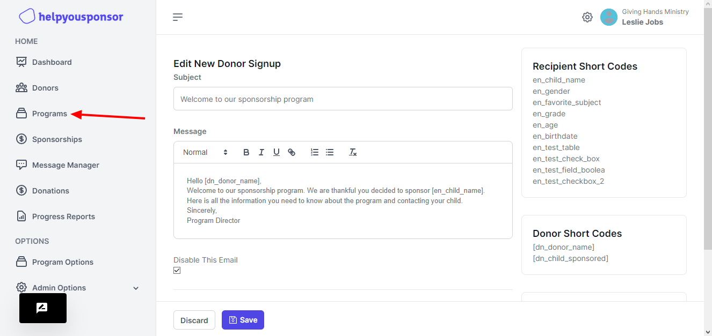
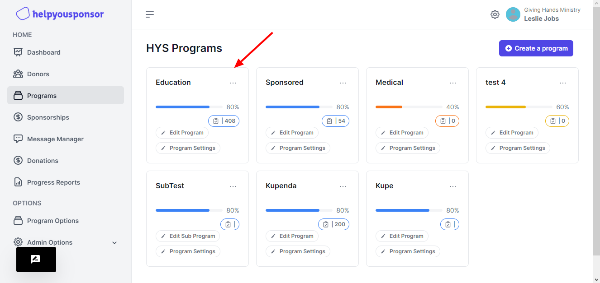
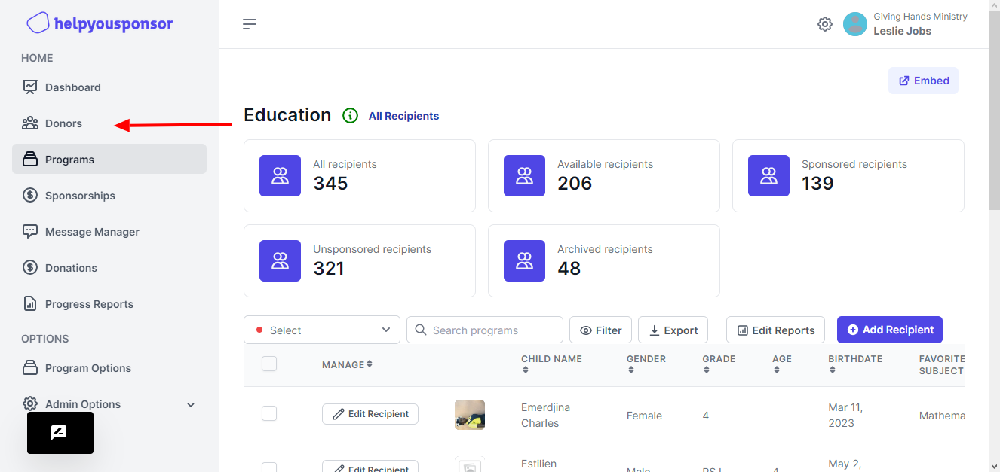
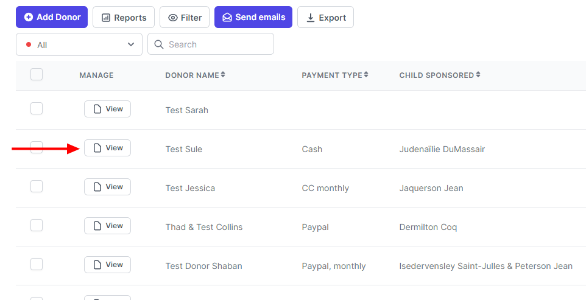
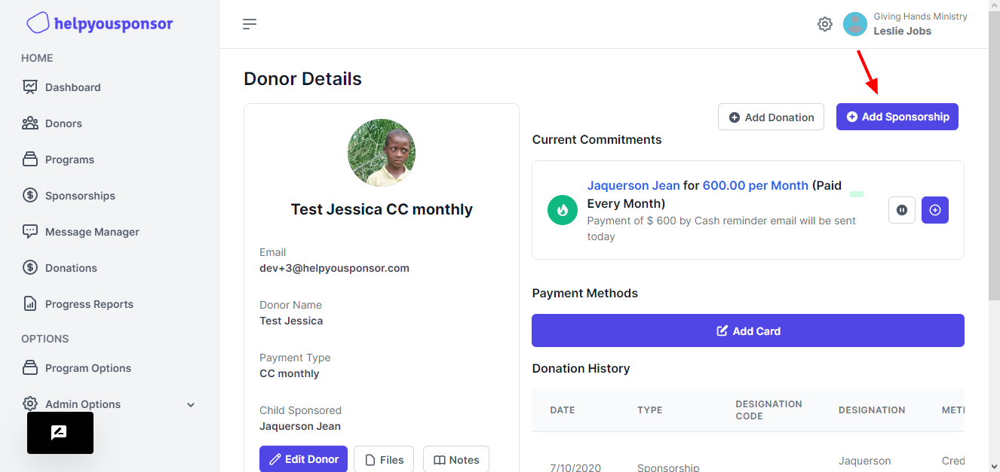
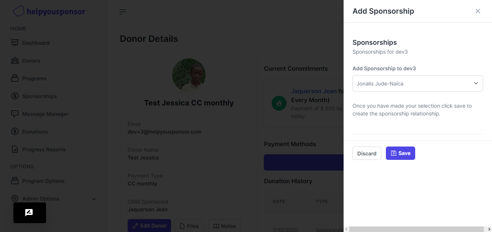
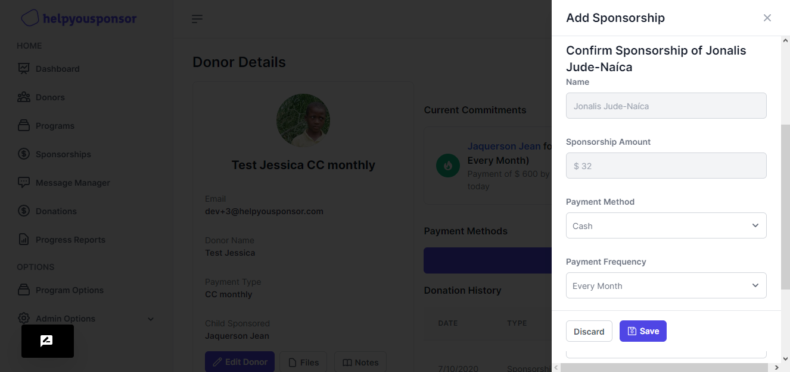
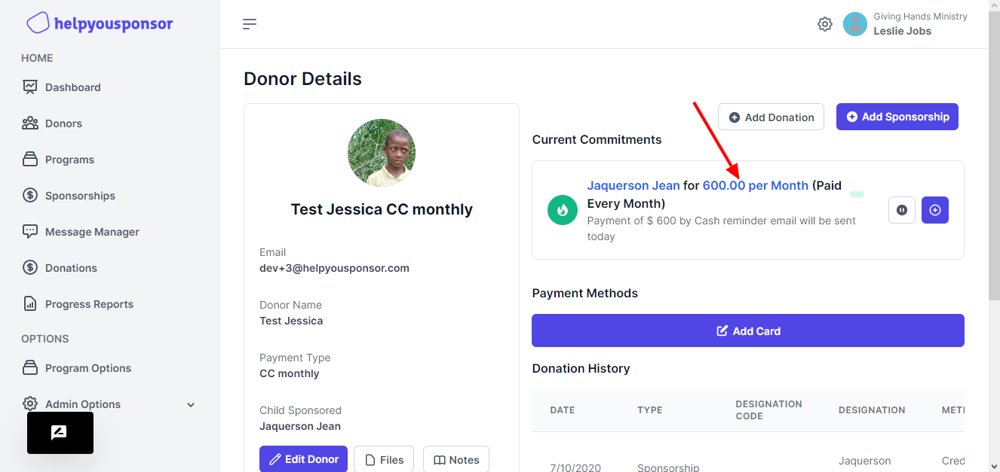
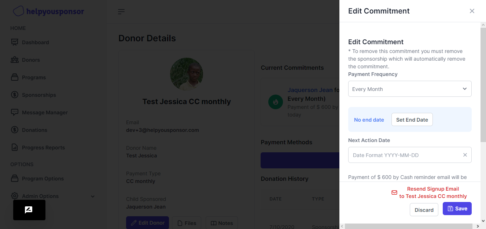

# Sponsorship assignment

### Which programs are my sponsorships coming from?

Often with HelpYouSponsor, you will set up a single donor form and have multiple recipient forms that use it.

This makes it easy to see a big list of all your donors, you just click on the donor tab at the top and choose your donor form.

However, what if you have a lot of different programs, how can you see which donors are attached to which programs?

Here's how:&#x20;

Click on 'Programs' at the side bar

<figure><figcaption></figcaption></figure>

Then click on the program you wish to see the sponsorships for

<figure><figcaption></figcaption></figure>

This page will display all the sponsorships within the program you selected (in this case, "Mango Tree School")

**What about Sub Programs?**

Sub programs are used to share the same set of recipients with multiple donors, or with multiple settings.

**Admin Created Sponsorships**

When a sponsorship is created by the administrator, you will be given the choice as to which program the sponsorship belongs.

To do this, click on Donors:

<figure><figcaption></figcaption></figure>

Then click on the Donor form you wish to add the sponsorship to:

Then select the desired Donor

Or

Add a new Donor

<figure><figcaption></figcaption></figure>

Once you have found the Donor you would like to setup the sponsorship for, click "Add Sponsorships"

<figure><figcaption></figcaption></figure>

Now, select the Recipient you would like to connect with the Donor and click "Save"

<figure><figcaption></figcaption></figure>

If there are sub-programs connected to this recipient, you will see a box labeled "Program Assignment" at the bottom of the page. Otherwise, the sponsorship will automatically be assigned to the program that the Recipient resides in.

Select which program you want the sponsorship to belong to and (after filling out the other fields correctly) click "Save"

<figure><figcaption></figcaption></figure>

#### Donor Created Sponsorships

If a sponsorship is created by a donor (on the frontend) the program assignment will happen automatically based on the URL. So if the Donor signs up from the parent program, their sponsorship will be assigned to the parent program. If the Donor signs up via a Sub Program, their sponsorship will be assigned to that sub program.

### Viewing Sponsorships

#### Parent Program Sponsorships (all)

Regardless of which sub-program sponsorships are added via, they will always all show up under the "View"-> "View Sponsorship Summary" of the parent program. If your parent and sub-program don't share the same donor form, you will not be able to view all the donor fields from this page. However, you can access the System Fields (username, email, date added, etc)

#### Sub-Program Sponsorships

When you click on a sub-program and "View" -> "View Sponsorship Summary" it will only display the sponsorships that were added via that particular sub-program. If you are using differing Donor Forms for sub and parent programs, this will allow you to display the Donor fields correctly on a per-program basis.

<figure><figcaption></figcaption></figure>

<figure><figcaption></figcaption></figure>

Note: Sponsorships added to HelpYouSponsor prior to Nov 1 2014 have been automatically be assigned to the parent program. If you wish to change this assignment, you must do it by click on "Donations" for each donor and then click on the pencil Icon to edit the commitment. From here you can change the program assignment like this:

