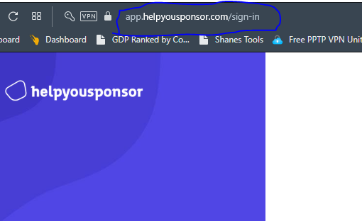
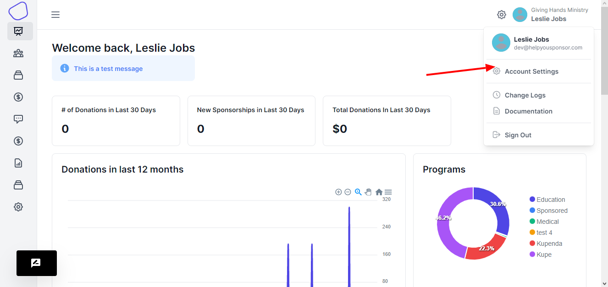
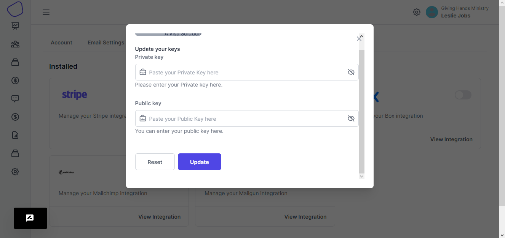

# Box Image Storage Setup

### Default 500px images

HelpYouSponsor's default configuration allows you to store images for both donors and sponsorship entities.&#x20;

All files that are uploaded are automatically resized to 500px.

This works well for online use and keeps page load-times down to a minimum.

### Need Larger Files?

We have now added integration with Box.com for you to store full-size images along with the 500px image in HelpYouSponsor.

### Box.com Setup

1\. First you will need to [create a box.com account](http://box.com/). \
It must be a paid account in order to utilize their ['direct link' functionality](https://support.box.com/hc/en-us/articles/200519908-Direct-Linking).

2\. After verifying your Box.com account, go to [developers.box.com](http://developers.box.com/) Create a "Box Content App" on Box.com&#x20;

First Click on "Get Started" then select "Box Content" and give your app a name (any name you like)

<figure><figcaption></figcaption></figure>

Click "Create Application" then proceed by clicking on "Configure Application."

You will then see the configuration page. Don't worry, you don't have to change anything here!

Box.com may require you to input a `redirect_url` parameter.

The redirect URL you need is:

https://app.helpyousponsor.com/admin/box\_response

(If you have a custom HYS URL, adjust the beginning the the URL accordingly)

Find the `client_id` (aka API key) and the`client_secret` fields and make a note of them, you will need them later.

<figure><figcaption></figcaption></figure>

3\. The explanation is a [bit technical](http://en.wikipedia.org/wiki/Cross-origin\_resource\_sharing), but you will also need to contact Box.com support to setup CORS.

Once you have your client\_id, write an email to [api@box.com](mailto:api@box.com)

You will need two things.

1\. Your client\_id (API key)

2\. Your domain name

Your HelpYouSponsor domain will differ depending on your individual setup.

To find your domain simply login to your admin login and look at the address bar.

<figure><figcaption></figcaption></figure>

In this example our domain name is "app.helpyousponsor.com"

Your email should say this:

> "We are using a box.com integrated application that needs CORS support enabled.
>
> Our client\_id (API Key) is : (Insert your client\_id here)
>
> Please enable CORS on our app for the following domains:
>
> http://(insert your domain here)
>
> https://
>
> (insert your domain here)
>
> Thank You!"

It may take a day or two for Box.com support to get back to you to let you know they have activated CORS for your domain.

HelpYouSponsor Configuration

Now, you will need to login to your HelpYouSponsor admin account.

Click on "Account Settings on the top menu"

<figure><figcaption></figcaption></figure>

Choose the integrations tab and choose `Authorize.net`

<figure><figcaption></figcaption></figure>

Then, go to add a file. It will redirect you to box.com's login page, and ask for your to 'grant access' to HelpYouSponsor.

Click "grant" and it will put you back on the dashboard.

If there is a redirect\_url\_mismatch error, make sure to login to HelpYouSponsor with HTTPS:// rather than HTTP://

Now, go to add a file again, and you will see an orange bordered drop-zone area where you can drag files.

