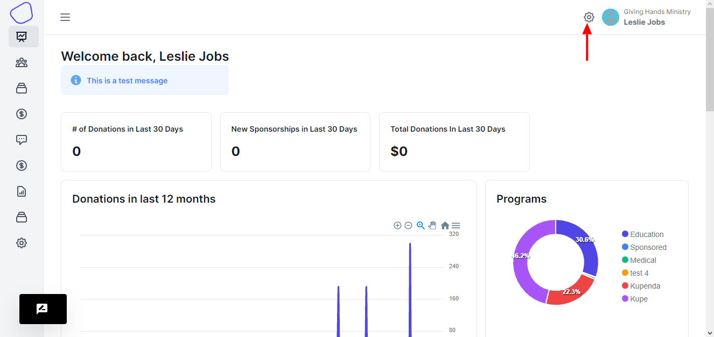
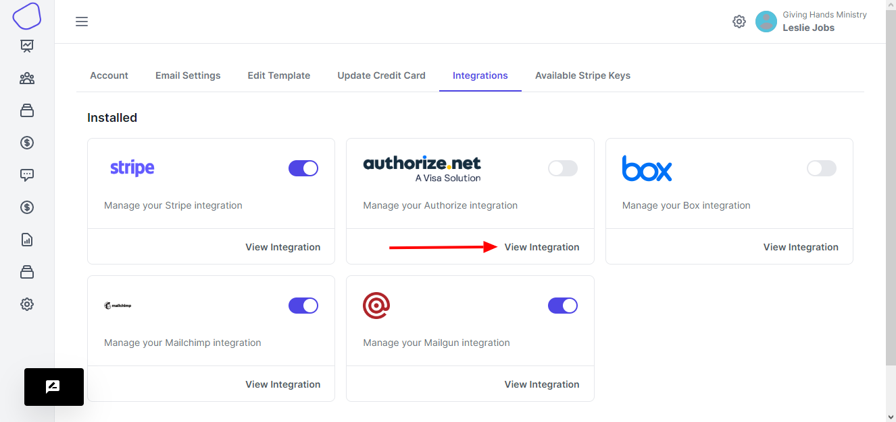
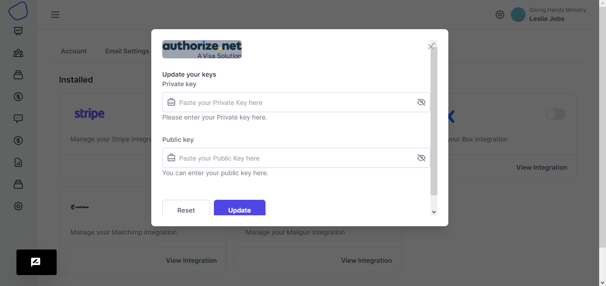

# Authorize.Net Setup

### Setup

To setup Authorize.net, you will need to create an account [http://www.authorize.net/signupnow/](http://www.authorize.net/signupnow/)&#x20;

Upon account creation, you will need to enable CIM (Customer Information Manager)

CIM is an Authorize.net feature that allows you to store donor credit card information on their server. Without this option enabled, you cannot use Authorize.net as your payment gateway with HelpYouSponsor.

After you have created your account, you will receive two pieces of login info from Authorize.net

1\. "Api Login Id"

2\. "Transaction Key"

To setup the gateway with HelpYouSponsor click on 'Account Settings' from the top menu on the right.

<figure><figcaption></figcaption></figure>

<figure><figcaption></figcaption></figure>

On the settings page, choose the integrations tab and then you choose Authorize.net&#x20;

<figure><figcaption></figcaption></figure>

Click save, and you are up and running with Authorize.net as your payment gateway.

### Testing

If you decide to do some testing before using this live, you can create a 'sandbox' account here: [https://developer.authorize.net/sandbox/](https://developer.authorize.net/sandbox/)

Be sure to put your 'sandbox account' into 'live-mode' (rather than 'test-mode') to do any testing.

### Switching Gateways

If you have previously used Stripe as your payment gateway, and would like to totally discontinue with Stripe, you should delete the "Stripe Secret Key" out of your Account.

If you wish to continue automatically billing your previously-input customers input through stripe, leave the Stripe Secret Key as it is.

It is not recommended to continue the use of multiple gateways, as it is just plain confusing.&#x20;

We recommend you pick one and stick with it!

### Default Gateway

The default payment gateway will always correspond to the most recently input key. So if you want to set a new default gateway, delete the key, hit save, put the key in again and hit save again, and your default will be changed.
