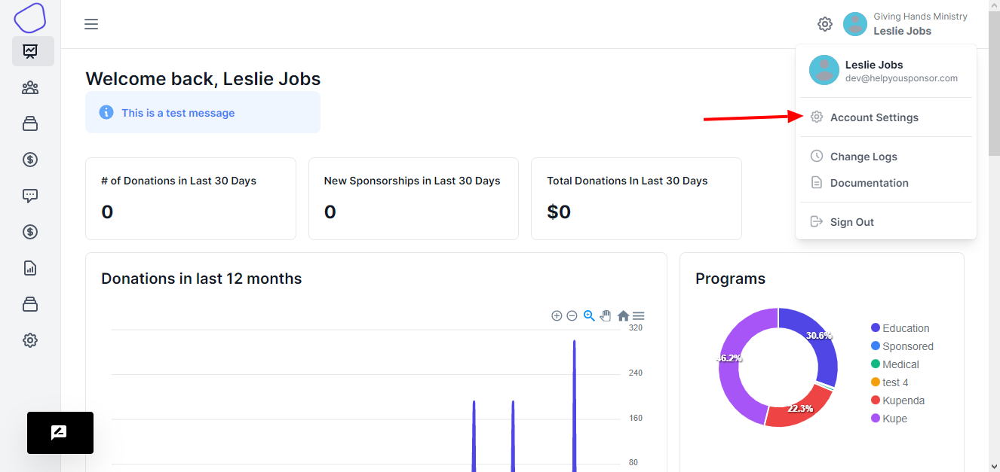
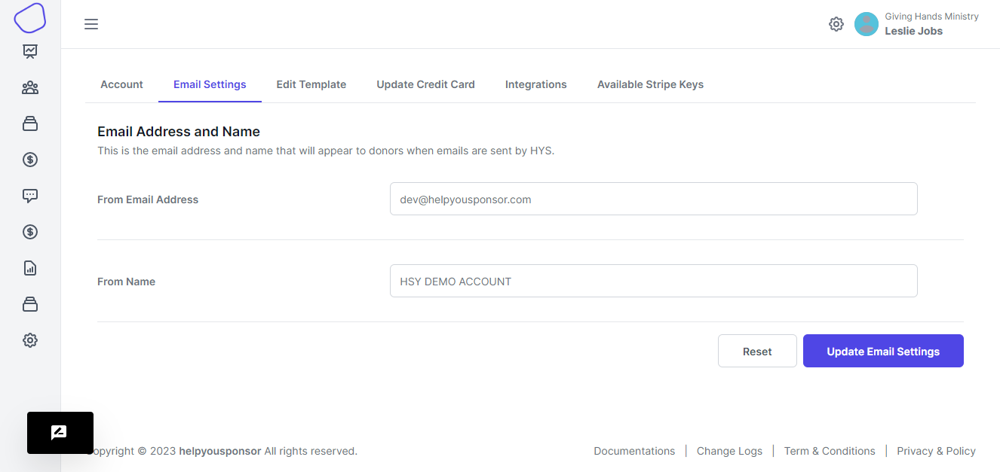
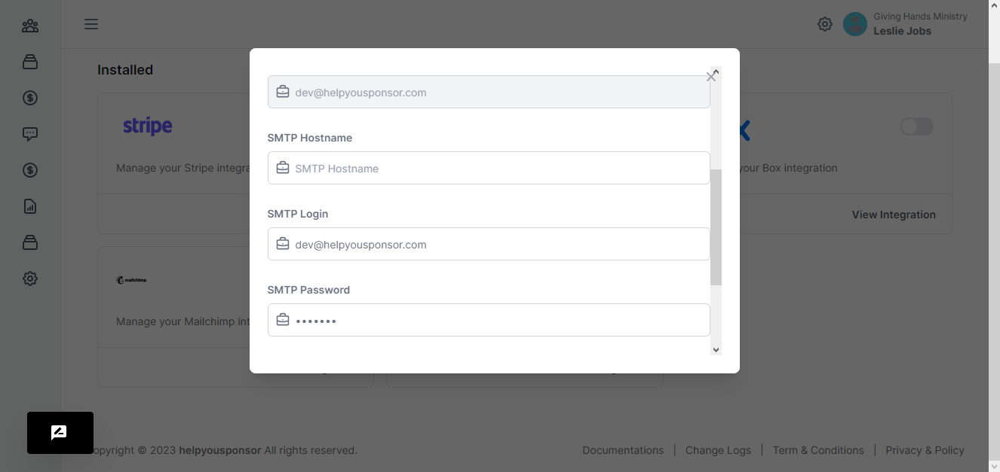

# Mailgun Setup

In order for system generated emails to be sent from an email address associated with your organization you will need to create an account with Mailgun by going to their website: [http://www.mailgun.com/](http://www.mailgun.com/). We use Mailgun to handle our transactional emails because it provides our clients an inexpensive way to ensure your emails are delivered. Mailgun allows up to 10,000 emails a month for free and beyond that the cost is very cheap.

Once you have created your Mailgun account and logged in click on the URL under the Custom Domains or you can use the Mailgun Subdomains if you don't have a custom domain set up:

<figure><figcaption></figcaption></figure>

Once you click on the domain name you will be brought to a page with your Domain Information.

<figure><figcaption></figcaption></figure>

Fill in the Email Settings under your account in HelpYouSponsor (click Account Settings in right  on top menu).

<figure><figcaption></figcaption></figure>

Then on the settings page, you click the Email Settings Tab to save the from email address and settings.

<figure><figcaption></figcaption></figure>

Then click the integrations tab, then choose the Mail gun option.

<figure><figcaption></figcaption></figure>

The From Name and From Address should be your organization name and organization's email address. The hostname is the SMTP hostname, the login is the Default SMTP Login, and the password is the Default Password from Mailgun.

Once you have filled in all the information click Save. HelpYouSponsor will now send email through your Mailgun account.

