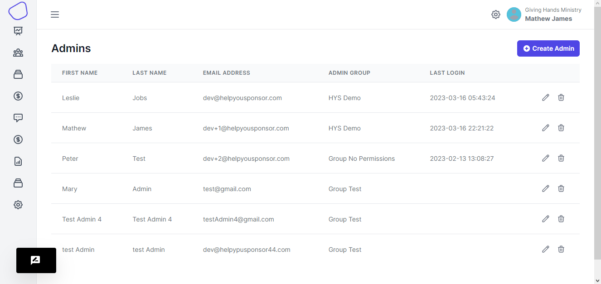
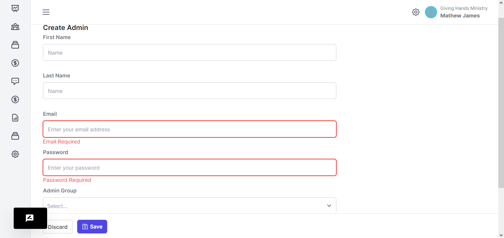
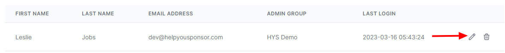
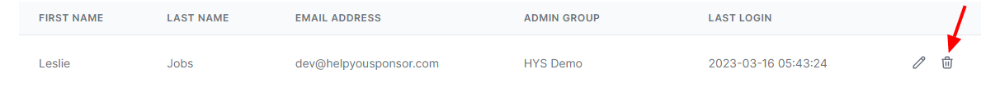

# Admins

<figure><figcaption>
admins
</figcaption></figure>

This page displays all the admins that are under this organization account

#### Create an admin

When you want to create an admin, you click the `Create Admin` button&#x20;

<figure><figcaption>
create admin
</figcaption></figure>

Your required to enter the first name, last name, email address, password.

Then from the  Admin Group dropdown you choose the group to place the admin.

#### Edit Admin

To edit details of an admin, you click the edit icon

<figure><figcaption></figcaption></figure>

#### Delete Admin

To delete the admin, you click the delete icon

<figure><figcaption></figcaption></figure>

