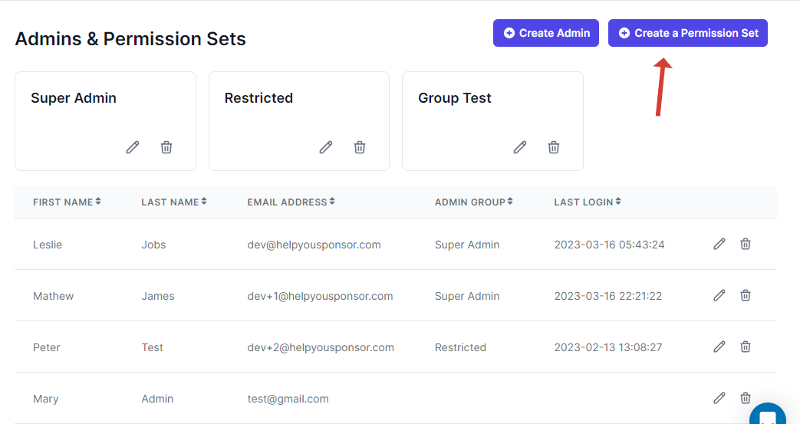
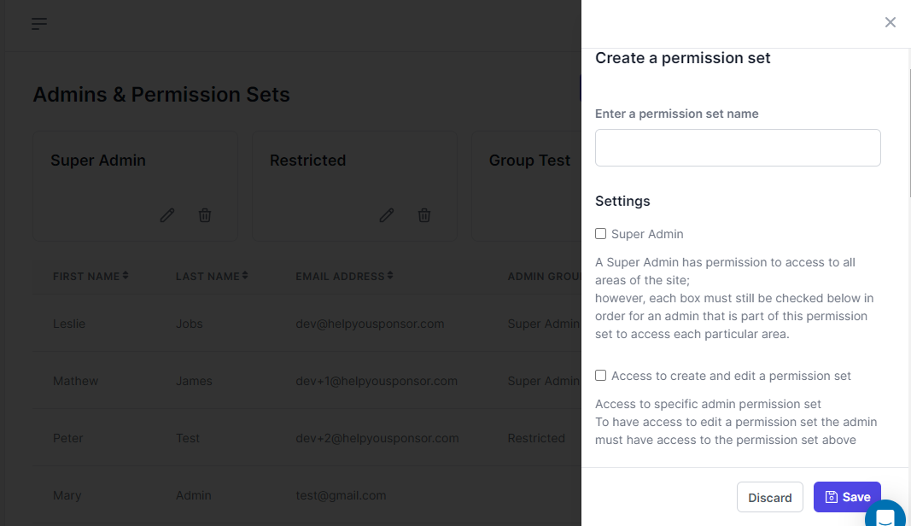
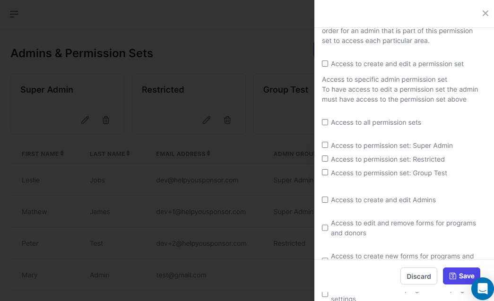
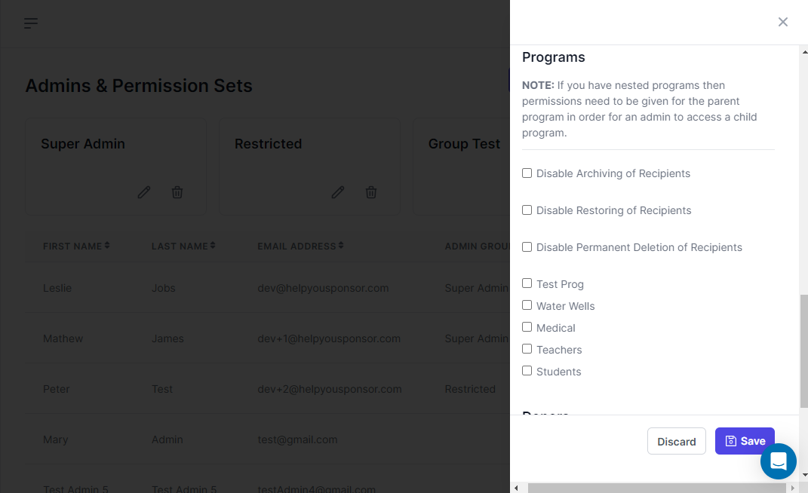
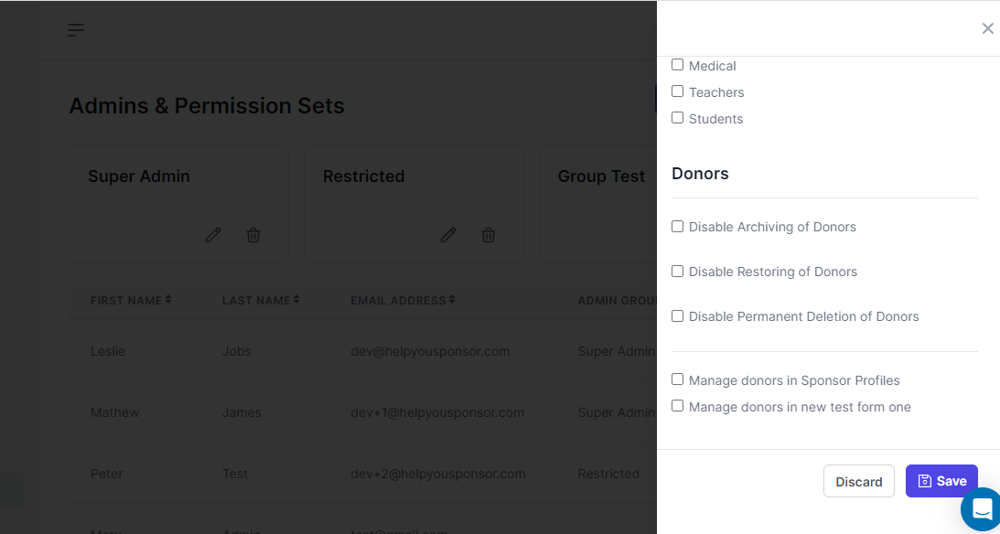
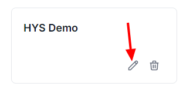
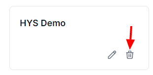

# Permission Sets

Create A Permission Set

When you want to create a permission set, you click the `Create a Permission Set` button

<figure><figcaption></figcaption></figure>

Once the  `Create a Permission Set` button is pressed, a drawer will appear.

<figure><figcaption>
You can now go ahead and fill in the permission set name and check relevant boxes
</figcaption></figure>

<figure><figcaption></figcaption></figure>

In the **Settings** section, we offer admins the 'Super Admin' right to access all areas of the site by enabling the 'Super Admin' checkbox. Additionally, within that permission set, we offer admins specific rights to edit and create permission sets by enabling the 'Access to create and edit a permission set' checkbox. Admins can also restrict and enable which permission sets to view by checking or unchecking the 'Access to permission set' checkbox.

<figure><figcaption></figcaption></figure>

In the **Programs** section you offer which program the admins in that permission set are allowed to view

<figure><figcaption></figcaption></figure>

In the **Donors** section, you offer restriction that an admin can operate in the donor's page

#### Edit a Permission Set

When you want to edit a permission set, you click the edit icon on the card of the permission set.

<figure><figcaption></figcaption></figure>

#### Delete a Permission Set

You can delete a permission set by clicking the delete permission set icon

<figure><figcaption></figcaption></figure>
