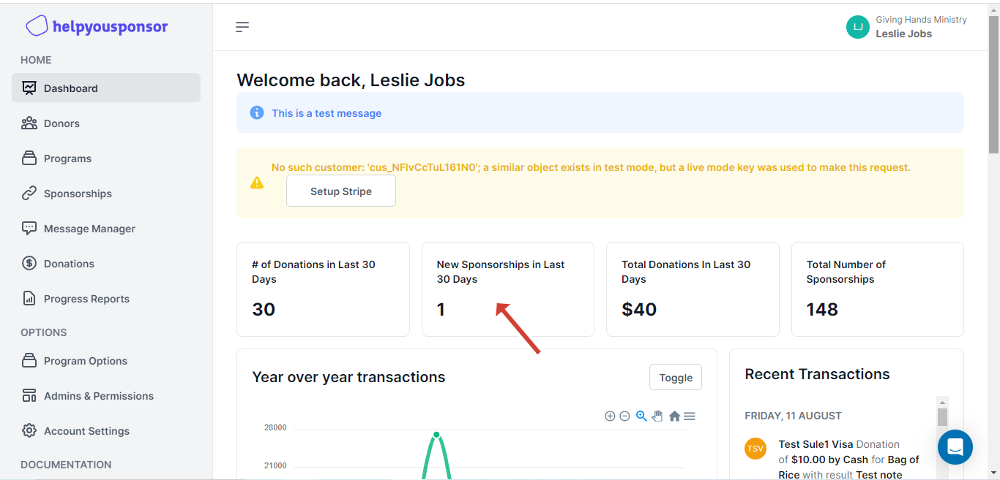
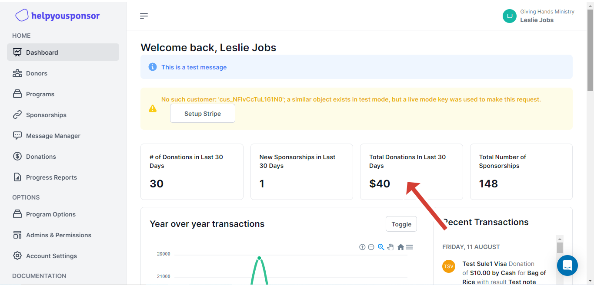
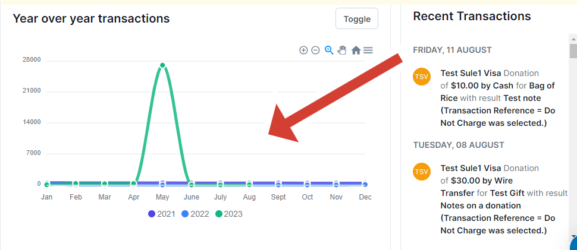
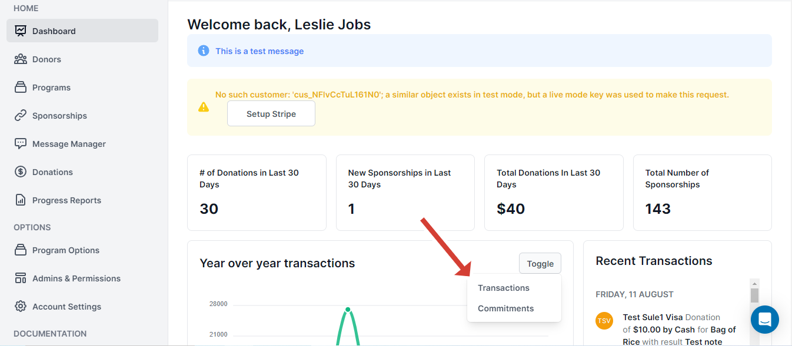
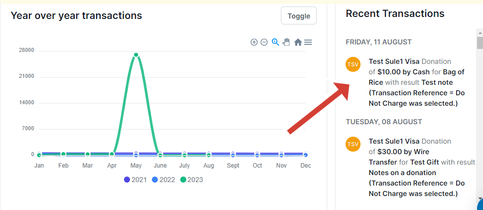

# Dashboard

On this page, you will find a list of features that provide a summarized view of the activities taking place in the platform, all associated with the organization. Additionally, any undefined settings that require immediate action will also be displayed here for easy accessibility.

<figure><figcaption>
HelpYouSponsor Dashboard
</figcaption></figure>

You can scroll down to view all of the dashboard. The dashboard contains the following options:

* **Number Of Donations**

<figure><figcaption>
Number of Donations
</figcaption></figure>

Here is the number of donations that have been sent to your account in the past 30 days. When you click on the number you will be taken to the donations page where you will be able to view the donations in details.

* **New Sponsorships**

<figure><figcaption>
New Sponsorships
</figcaption></figure>

This card displays the number of new sponsorships that have been activated in the past 30 days. In this case a sponsor or donor has been attached to a child that he or she will be sponsoring.

* **Total Donations**

<figure><figcaption>
Total Donations
</figcaption></figure>

This card shows the total number of donations in the past 30 days. This implies the donations that have been offered by the sponsors or the donors.

You can click the number to be taken to the donations page where you will get a full details about the donations.

* **Total Number of Sponsorships**

<figure><figcaption>
Total Number Of Sponsorships
</figcaption></figure>

&#x20;This card shows the total number of sponsorships in the whole account, this implies how many active sponsorships are there.

When you click the number you will be redirected to the sponsorships page to view all your active sponsorships.

* **Donations Graph**&#x20;

<figure><figcaption>
Donations Graph
</figcaption></figure>

This is a graphical representation of donations in the past 12 months.&#x20;

* Toogle Button

<figure><figcaption>
Toggle Button
</figcaption></figure>

The toggle button can be used to switch between displaying transitions or commitments over a year. This allows you to easily switch and view the data related to either transitions or commitments for a specific time period of one year.

* Recent Transactions

<figure><figcaption>
Recent transactions
</figcaption></figure>

This section displays recent transactions between a donor and a recipient, providing summarized information on whether the transaction was successful or not. This information is synchronized with the transactions graph.
