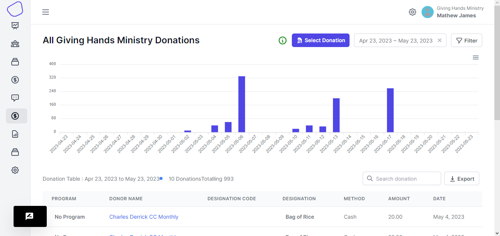
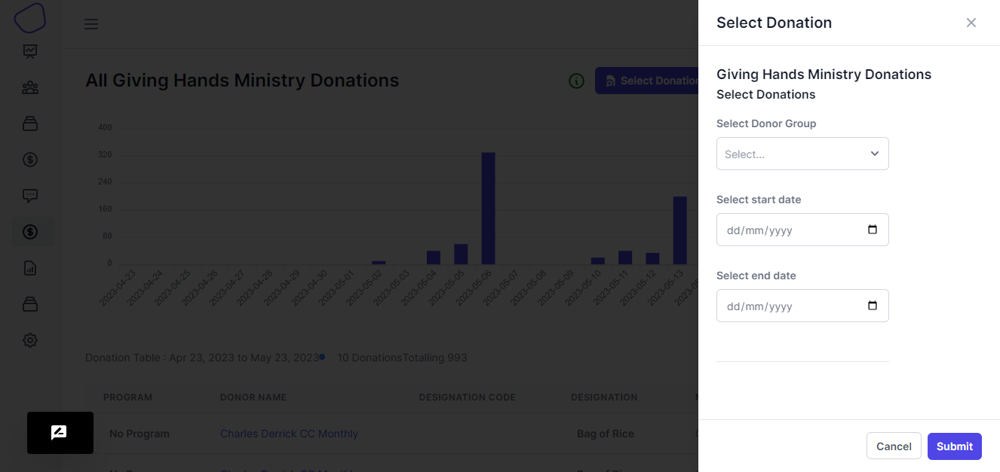
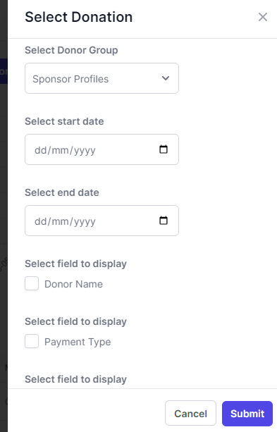
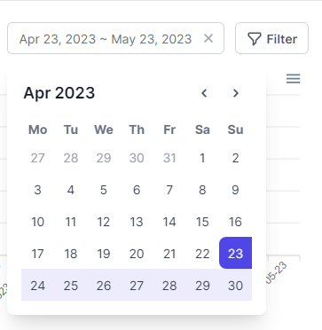

# Donations

<figure><figcaption>
donations page
</figcaption></figure>

This page displays all the donations that have been made to your organization. And it offers a visual representation for the data onto a column graph. There a couple of features that are on this page

#### **Select Donations**

When you want to view donations that have been made for a particular program, you can make use of the `Select Donations` button

<figure><figcaption></figcaption></figure>

You will be presented with a drawer on the right

<figure><figcaption></figcaption></figure>

On the drawer, you will required to choose the Donor form so that the fields that you created on the form will show up and then you select whether you want to display those fields on the donations table.

<figure><figcaption></figcaption></figure>

Once you have chosen the donor form that you want to use, then you have to choose the date range that you want to view so that the donations will be between that range.

And then hit `Submit` so that you load the new data onto the table.

#### **Donations date range picker**

In the case where you just want to select the date range from the donations page without going through the above steps

You can use the Datetime range picker.

<figure><figcaption></figcaption></figure>

When you choose the date range, hit the `Filter` button and then you will get the table load with the dates that you chose

#### **Search on the table**

When you have to search for a particular information on the table, you can use the search feature for that.

> You can also use the pagination feature so that you only display the number of records on the table as what you want.

#### **Export table data**

When you want to export the table data, you only have to click the `Export` button to export the data in a csv format.

