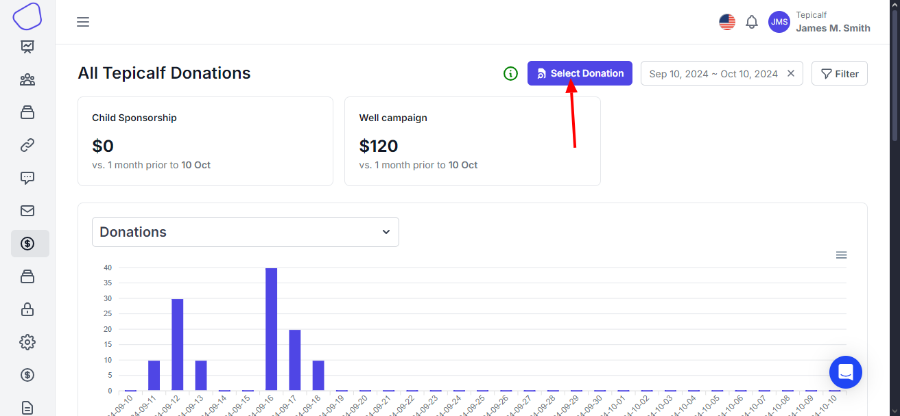

# Create Donation Views

This is a way to create a view for certain donations. Then be able to just choose from the list of created views to load the donations.\
This requires that you create the respective information required to generate the view and then you'll place a name and then submit.

> Incase you do not place a view name, then it will not be created. But the donation details will be generated

<figure><figcaption>
choose select donation
</figcaption></figure>

You'll have to choose the select donation button to open the drawer

Choose the `Create View` tab \

<figure><figcaption>
create view
</figcaption></figure>

In this form you'll have to choose the sponsor form that was used to create the donors. This is because your going to view donor information from each donation and you'll have to choose the form fields that you want to view.

Select the **start date**; this is date you want to view the donations from

Select the **end date**; this is the date you want the range to stop at.

We added a new feature for you to choose whether you want to view recurring or one time sponsorship donations.

**Report Name**; Will be the name that you'll give to the view.

Then **Submit** , your view will be saved and also the donations data loaded on the table

#### View saved views

Once you have saved views, you'll be able to view them on the first tab as you open the drawer.\

<figure><figcaption>
saved views
</figcaption></figure>

With the list of saved views you can choose to view the saved donations according to the views or delete the saved views.
