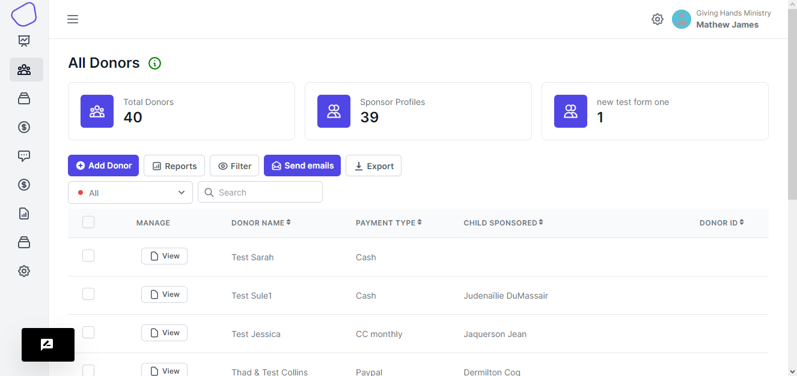

# Donors

This page walks you through various sections, features and menus that you'll find within the Donors page.

<figure><figcaption>
Donors Page
</figcaption></figure>

The page has a couple of features that enable you to see the details of the donors.

The page contains:

*   Stats Cards

    These include cards that have Total Donors that have are listed in your account. Then There is a list of donor forms , these are the forms that are used to create a new donor. Each individual card containing the form will also have number of donors that were created using that form.
*   Reports

    Here your able to create particular table columns that you want to view and then save them so that you can always choose a view that you want to have.
*   Add Donor

    Your able to create a new donor onto the list of donors that are in a particular form.
*   Filter

    Here your able to filter the list of donors or sponsors so that your able to view donors that have been archived and those that have not been archived.
*   Send Email

    Here you have the functionality to send emails to your donors, these emails might contain annual emails
*   Export

    Here you are able to export the table details in a csv form so that you can open it in any spreadsheets program.
*   Search

    Your able to quickly find the donors by searching for them, but remember that you can only search by the columns on the table that you chose to view
*   Select/Dropdown

    Here you can select the forms in which the donors are in so that can only view them
*   Pagination

    You can use the pagination feature to view through the donors list.
*   View Donor

    It is a button were you can go to a separate page for the donors.

