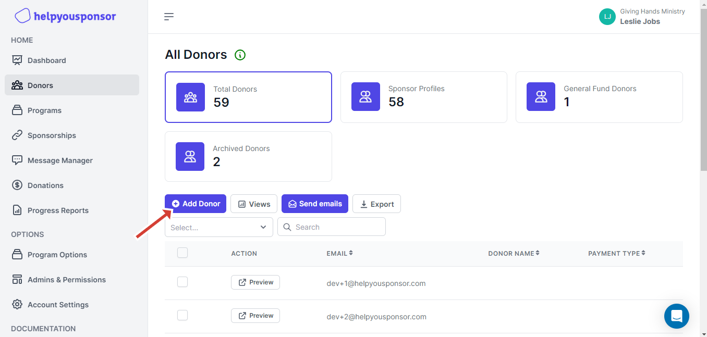
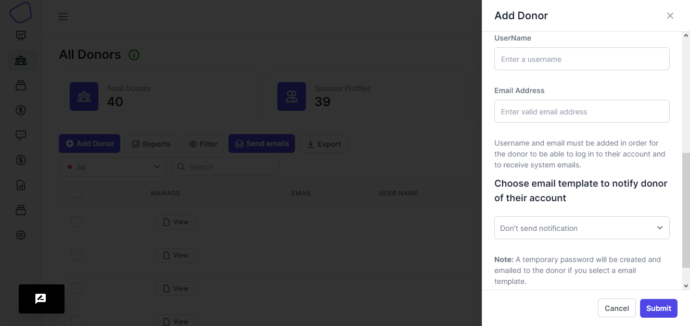

# Add Donor

> When you want to add a new sponsor or donor onto your program. You will have to first have to create a **Donor form** and then link it to a program in the program settings

When on the Donors page, you will see the table showing all the donors on a form that have been attached to it.

<figure><figcaption>
Add Donor
</figcaption></figure>

This will open a drawer on your right so that you are presented with a form.

<figure><figcaption>
Donor form
</figcaption></figure>

You will can then insert in the donor details according to the form that you created.

There fields that you might have made required and those that might have been optional.

Then you have the option to notify the new sponsor that you have created to receive an email that notifies him or her about their account on the platform and also link to your programs
