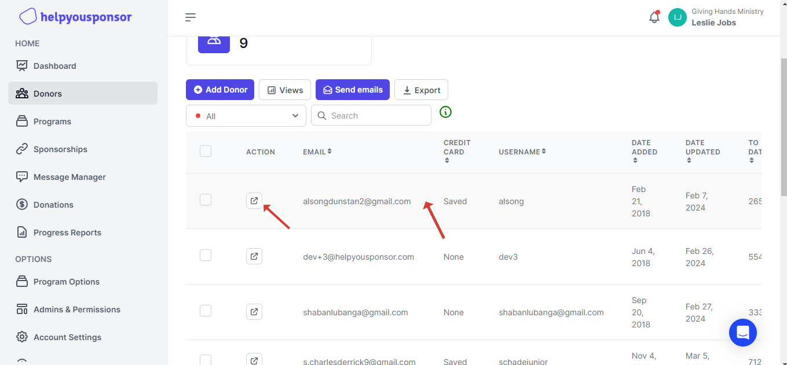
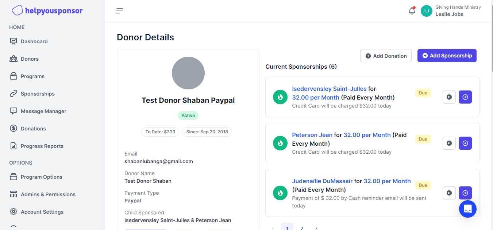
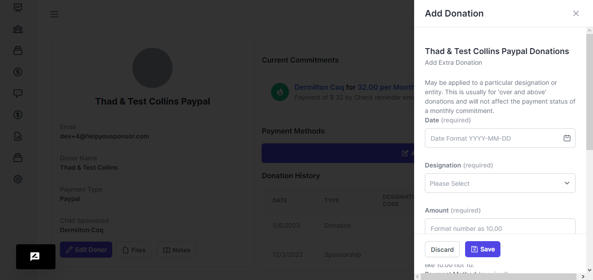
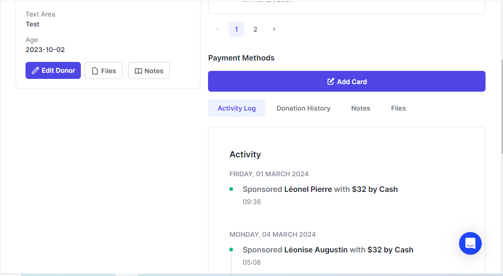
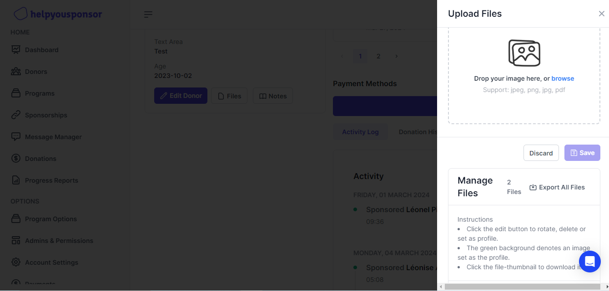
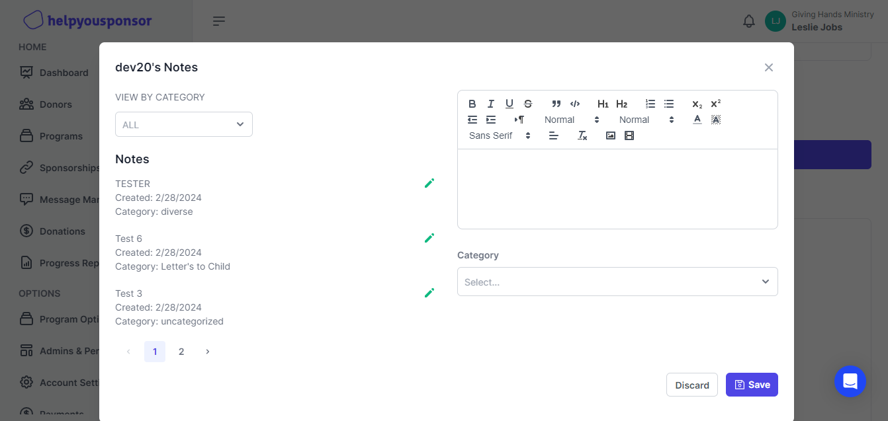
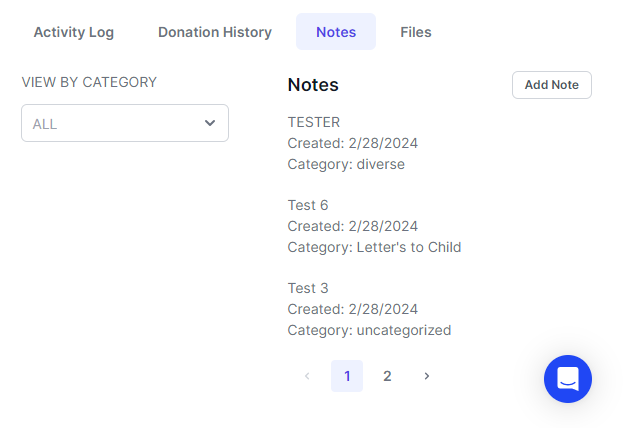
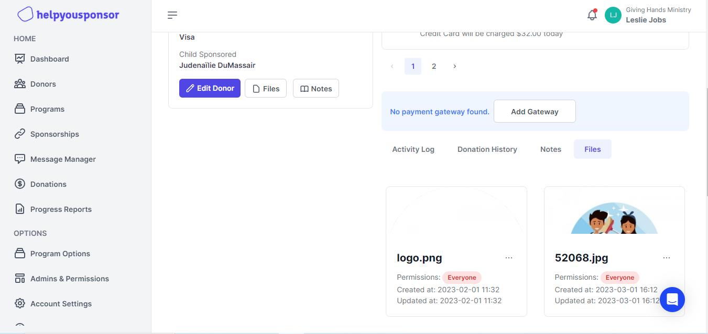
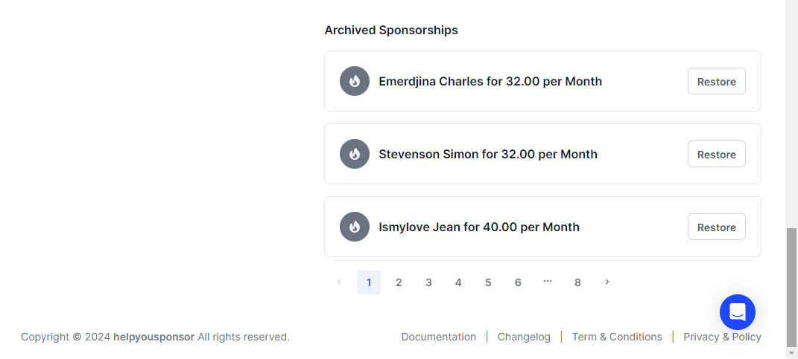

# Donor Profile Page

To view a donor from the donors table page, you can either click on a row corresponding to that specific donor, which will redirect you to the donor profile page, or click the external icon. The latter action opens an edit donor drawer containing a "Open Full Profile" button that leads to the donor's profile page.

<figure><figcaption>
Donor  Table
</figcaption></figure>

You will be taken to a donor profile page

<figure><figcaption>
Donor Profile Page
</figcaption></figure>

The donor profile page consolidates the donor's activity and profile on a single page. It displays current sponsorships and their total, donor details including the joining date, and the total donated over that period. Additionally, the page features a donation history table, files, and notes. Each aspect is explained in more detail below:

**Add Donation**

To add a new donation, click the "Add Donation" button, which opens a drawer on the right.

<figure><figcaption>
Add donation drawer
</figcaption></figure>

The form will guide you through the process when adding a new donation. Once all the required fields are filled out, click "Save" to save the donation.

**Add Sponsorship**

To add a new sponsorship, click the "Add Sponsorship" button, which will open a drawer.

<figure><figcaption>
Add Sponsorship
</figcaption></figure>

You will be presented with a form that includes a dropdown listing all available recipients to sponsor in the program

After selecting the recipient you wish the donor to sponsor, click "Load" to establish the relationship. Finally, click "Save" to secure the sponsorship.

**Current Sponsorships**

Here, you will see a list of current sponsorships that have been added, with the ability to preview the recipient's profile directly on that specific card. Additionally, you can archive the sponsorship, add a payment to it, or edit that specific commitment.

**Payment Methods**

This option enables the integration of a payment gateway for the donor, which can be any of our available payment options. If no gateway is integrated, you will be presented with a banner that will redirect you to the Payments page to integrate one. If a gateway like Stripe is already integrated but no card is available for a specific donor, a button will appear, prompting you to add a card for that particular donor.

On the left, within the donor profile card, there are various options as follows:

<figure><figcaption></figcaption></figure>

*   **Files**

    This button, when pressed, opens a drawer that displays the files stored for this specific donor or sponsor and also provides the ability to upload new files.

<figure><figcaption></figcaption></figure>

*   **Notes**

    Pressing this button opens a dialog that enables you to view the notes you have recorded about this particular sponsor.

<figure><figcaption></figcaption></figure>

*   **Edit Donor**

    This button will open the edit donor drawer, enabling the editing of information about the sponsor.\

**Donor Details Tabs**\
These tabs facilitate navigation through four main sections: the Activity Log tab, summarizing recent donor activity; the Donations History tab, which lists all donations by the donor, encompassing both recent and past contributions;  the Notes tab, providing a summary of the main notes and the Files Tab that offers a preview of files uploaded for that specific donor.

<figure><figcaption>
Activity Log Tab
</figcaption></figure>

<figure><figcaption>
Donation History Tab
</figcaption></figure>

<figure><figcaption>
Notes Tab
</figcaption></figure>

<figure><figcaption>
Files Tab
</figcaption></figure>

Lastly, at the bottom of the donor profile page, if a sponsorship is archived, it will appear at the bottom. The card will also have the option of restoring that particular sponsorship.

<figure><figcaption>
Archived Sponsorships
</figcaption></figure>

\
\
\
\
