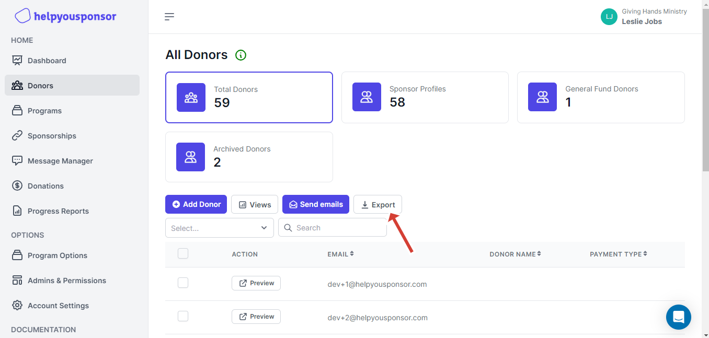
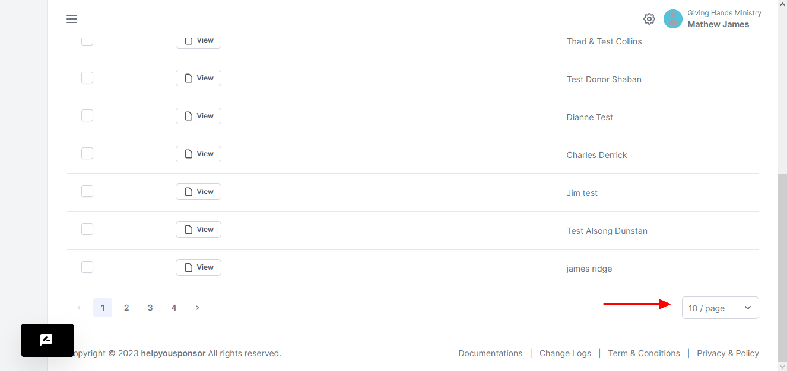

# Export Donor

<figure><figcaption>
export donor
</figcaption></figure>

When you want to export the donors table, you have to click the :arrow\_down: Export button.&#x20;

The format of the downloaded data will be a csv file.

Only the table that is being displayed on the table will be downloaded, so you can use the select feature at the bottom of the table to choose how many table records that you want to display.

<figure><figcaption>
pagination
</figcaption></figure>

You have the option to choose how many records that you want to display on the table.\
Another thing to note is that only the table columns that are available on the page are the ones that will appear on the exported file.
