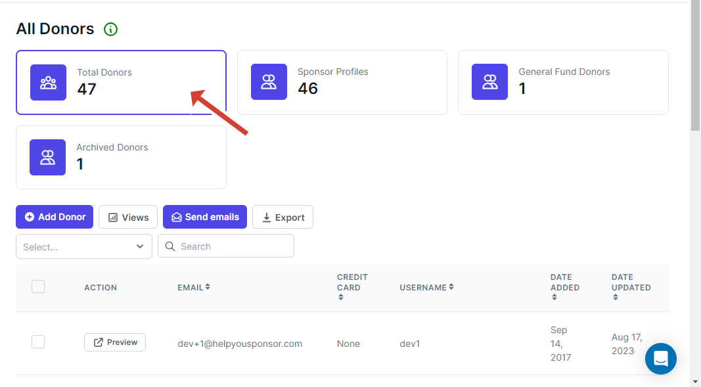
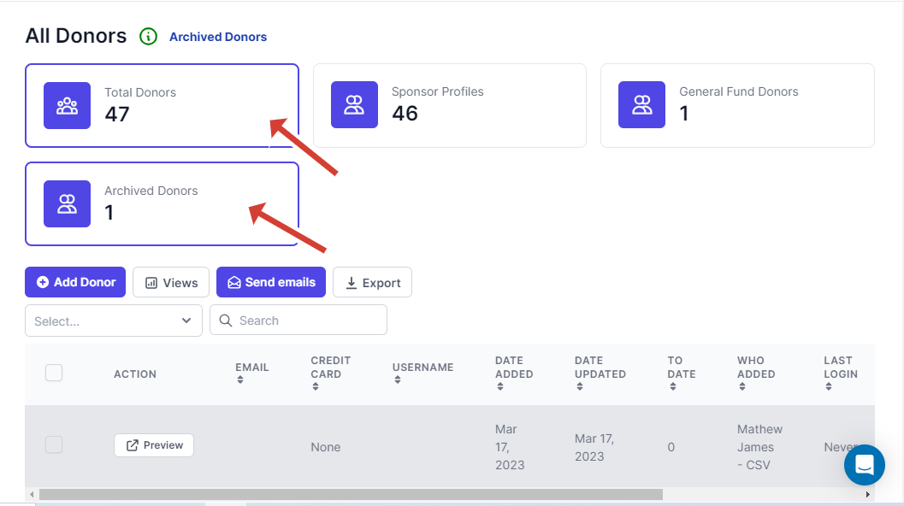
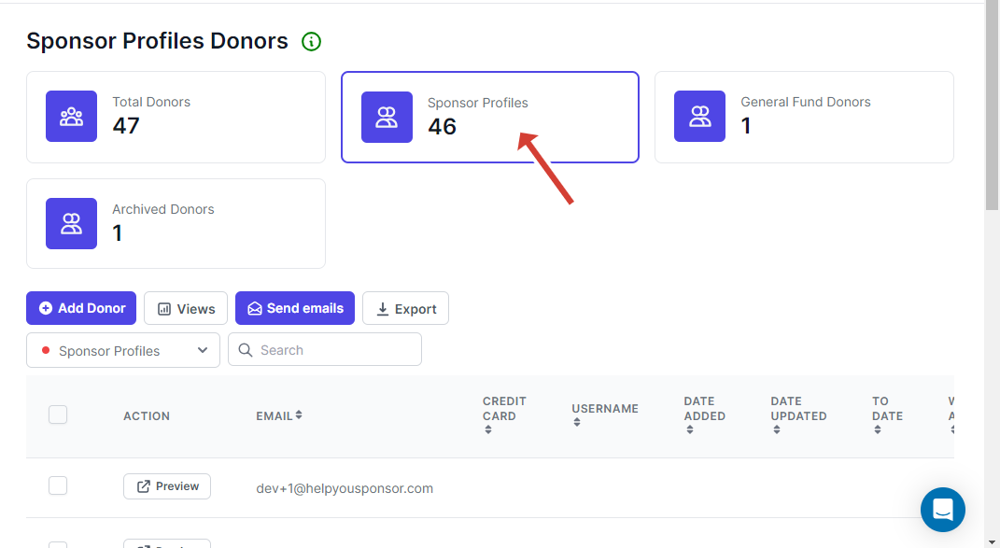

# Filter Donors

On the donors table you are able to view available donors and then donors that you might have archived.

To filter, click on the cards above the table. For example, to view all the donors, click on the "Total Donors" card. To view archived donors from the total donors, click on the "Archived Donors" card to retrieve the data. To view a specific attached donor form, click on the respective card and then click on "Archived Donors" to retrieve the archived data for the specified donor form.

<figure><figcaption>
Total Donors retrieved.
</figcaption></figure>

<figure><figcaption>
Total Donors and archived records under it.
</figcaption></figure>

<figure><figcaption>
Retrieving data from specific attached donor form.
</figcaption></figure>

