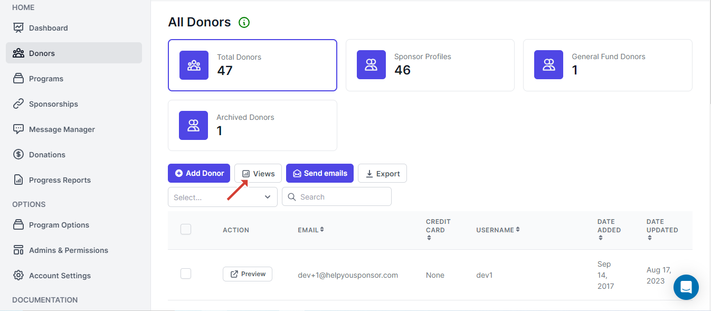
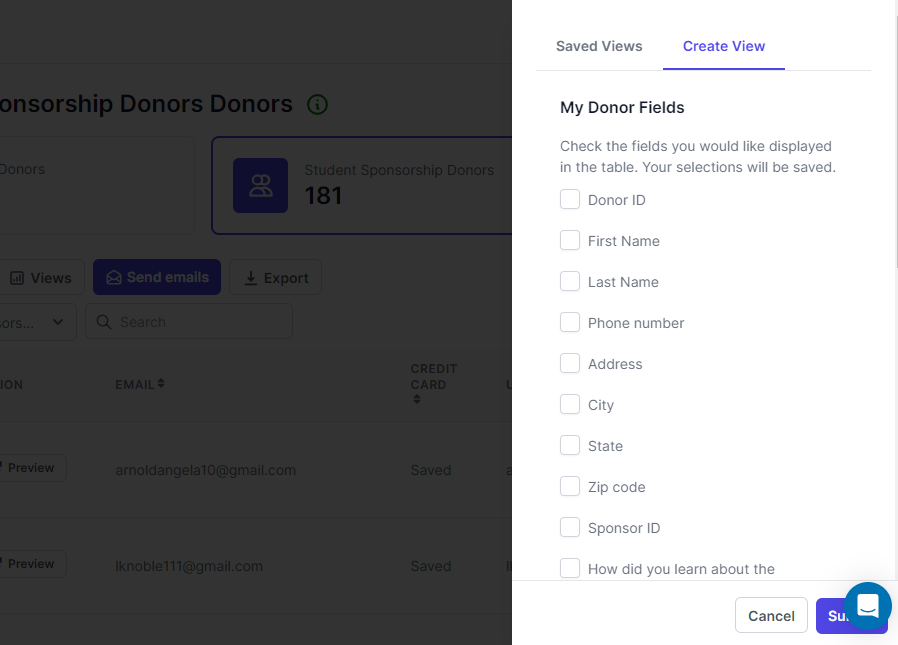

# Views(formerly known as Reports)

The table columns that are displayed on the donors table depend on the donors form fields that the donors are attached to.

So incase that form has 13 fields, by default we don't display all the fields as column headers.

So when you want to display other fields as column headers on the donors table, then you will have to click the Views button

<figure><figcaption>
Views button
</figcaption></figure>

This will open a drawer on your right

<figure><figcaption>
Drawer
</figcaption></figure>

On the drawer you will be presented with two tabs **Saved Views** and **Create View**. &#x20;

*   **Saved Views**

    This tab displays the saved customized table header columns that you chose to display. When you click :eye: you will be able to load the donors table data with the column headers that you had selected when you were creating the view. And then you can  also delete the view
* Create View

<figure><figcaption>
Create View
</figcaption></figure>

On the next tab you will be presented with a list of fields that your donor form has and that will appear below the **My Donor Fields** and then **System Donor Fields** are the fields that we also offer as options. You check the field that you want to view on the table and then when your done choose the fields

You have to give the view a name

<figure><figcaption>
Name View
</figcaption></figure>

When your done giving the view a name, then you can click the Submit button to save the view and then the donors table will load with the columns that you have chosen.
