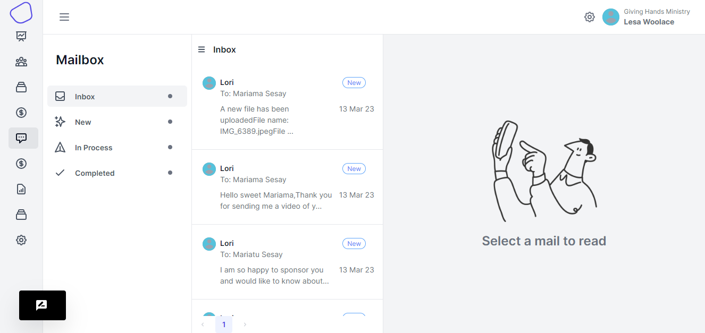
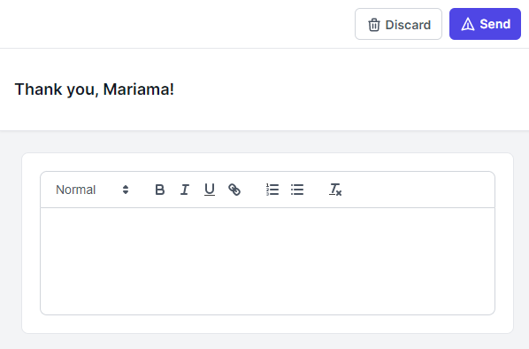

# Message Manager

<figure><figcaption>
email manager
</figcaption></figure>

<figure><figcaption></figcaption></figure>

This is the page that contains all the conversations that have been taking place between the sponsor and the recipient.

You can view status of the different mails for example there those that are new.

#### Inbox tab

When you click the Inbox tab, you will be presented a view that shows all the messages that have ben taking.

<figure><figcaption>
message list view
</figcaption></figure>

You will be viewing the name of the sender of the message and then you will also view the name of the recipient of the message. There is also the status of the message, these can be `New` , `In Process` and `Completed`

Also there is date of when the message was created.\

#### Message View

<figure><figcaption>
message view
</figcaption></figure>

In the message view, there a variety of features. There is the status of the message being displayed.  You can click the button to toggle through the status of the message.

#### Assign Admins&#x20;

Enables you to assign one of your admins to a conversation to that it can be monitored. A dropdown appears containing the names of the admins and then choose one to be monitoring the conversation.

#### Reply to Message

When you want to reply to the message as an admin, you click the button containing `Reply`

<figure><figcaption>
Reply view
</figcaption></figure>

You are presented with a view that contains a form for you to write your message response.

\
