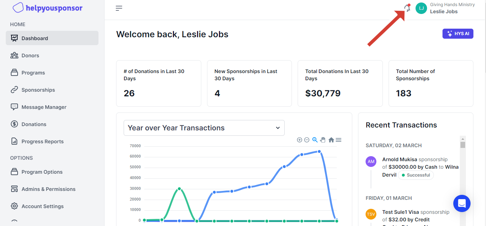
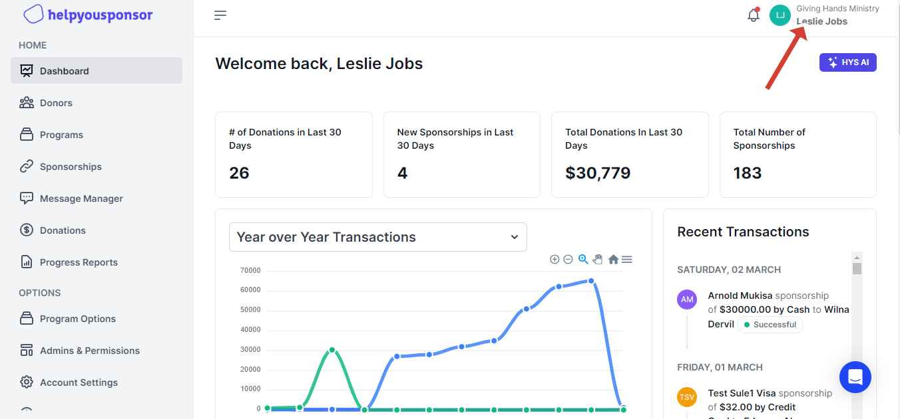
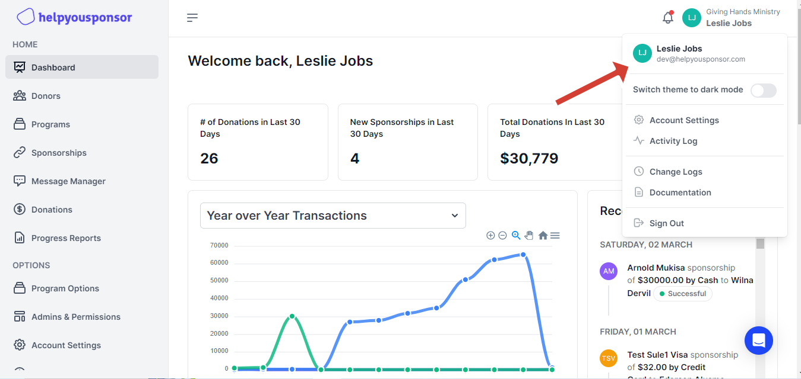

# Navigation

This page walks you through various sections, features and menus that you'll find within the HelpYouSponsor app. Start by creating or logging into your account at [app.helpyousponsor.com](https://app.helpyousponsor.com).\

> **Permissions**\
> The sidebar can be viewed by everyone, although users in a specific permission set might have different permissions assigned to the permission set.
>
> Only the main admin of the Organization has the authority to Create the permission sets and then assign various permissions to the set.

You can use the arrow near the top to open and close the sidebar. Closing the sidebar might be helpful when you want more space for viewing.

The sidebar contains:

## &#x20;Top Navigation

<figure><figcaption>
Notification Icon
</figcaption></figure>

<figure><figcaption>
 User Dropdown
</figcaption></figure>

<figure><figcaption>
Clicking the notification icon displays all recent activities.
</figcaption></figure>

<figure><figcaption>
Clicking the user dropdown reveals additional options.
</figcaption></figure>

The top menu bar includes a notification dropdown, represented by a notification icon. When clicked, this dropdown reveals all the recent activities associated with the specific account. Additionally, there is a user dropdown that displays both the name of the organization to which the current user belongs and the email of the admin currently logged in. Clicking on this triggers a dropdown to appear with various options, such as:

* **Switch theme to dark mode**, which replaces the default light mode with a dark mode.
* An **"Account Settings"** option that leads to the account settings page.
* **"Activity Log"** that leads to the activity log page that displays recent account activities.
* The **"Change Logs"** option, which redirects you to the ongoing updates on the platform.
* The **"Documentation"** option, which takes you to HelpYouSponsor's documentation.
* The **"Sign Out"** option is for logging out of the application.

