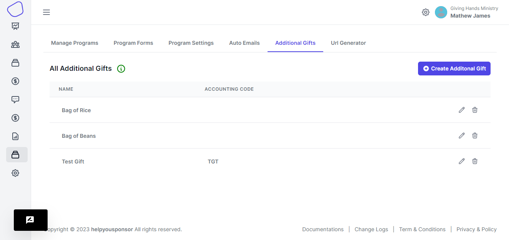
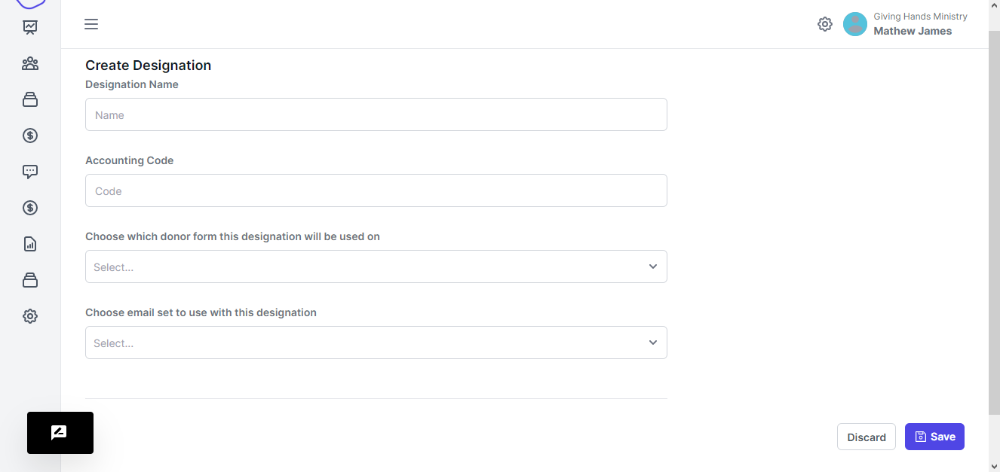

# Additional Gifts

Info About Additional Gifts Additional gifts are for when a donor wants to add an additional amount of their choosing when they signup for sponsorship.

Some examples of Additional Gifts: Christmas Gifts for Students Dormitory Repairs School Supplies You may add Additional Gifts to you programs by enabling 'Display Additional Gifts on order page' in the program settings.

You can also use the Share links to allow donors to contribute directly without being associated with a sponsorship program.

Additional gifts are designed simply to be tacked onto a sponsorship program.

If you want to raise money specifically for one-time projects that need a total amount, you should look into creating a funding program.

<figure><figcaption>
Additional Gifts
</figcaption></figure>

#### Create Additional Gift

When you want to create a gift. You click the `Create Additional Gift` button.

<figure><figcaption></figcaption></figure>

You place a name to place on the designation, then you can also place a code to identify the designation

You then choose from the dropdown  which donor form you want to attach this designation

Then choose the email set that you want to attach this designation to.
