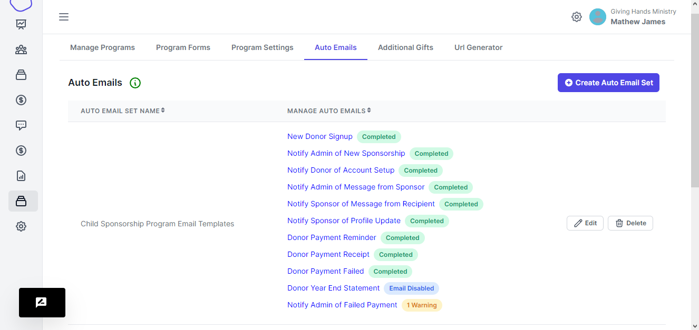
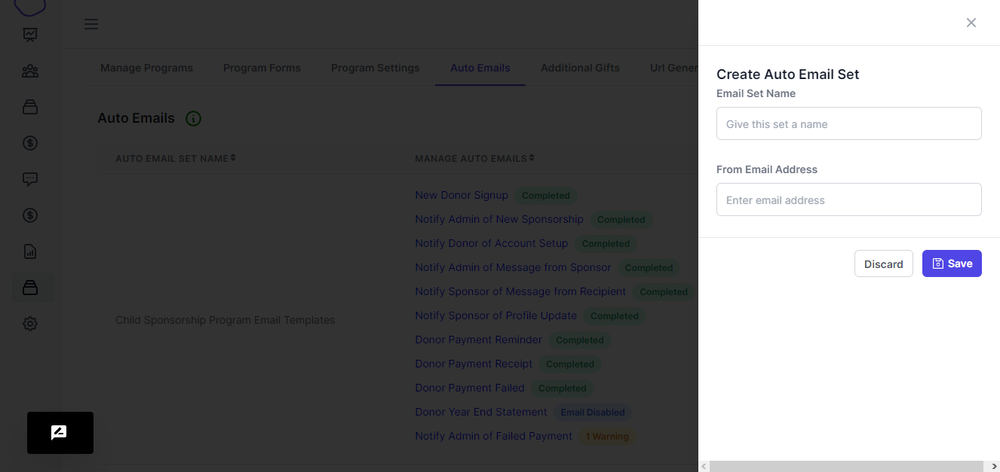
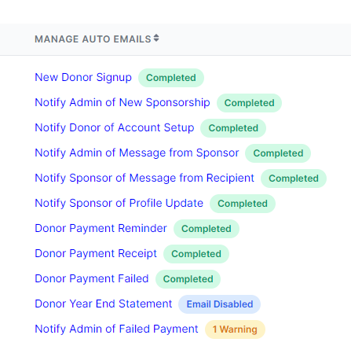
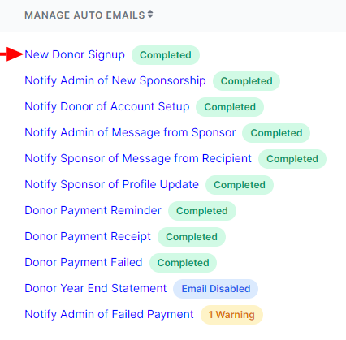
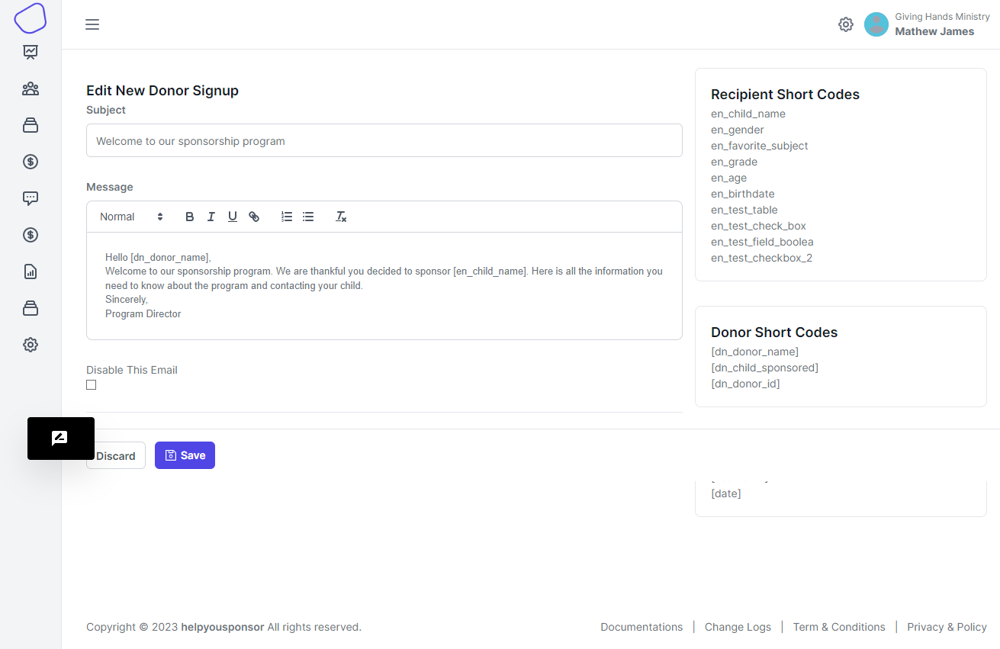

# Email Set Templates

<figure><figcaption></figcaption></figure>

#### Create Email Set

When you want to create an email set, you click the `Create Auto Email Set` button. You will be presented with a right drawer

<figure><figcaption></figcaption></figure>

You enter the name of that you want to place on the email set and also the from email address that will be used when sending emails.

<figure><figcaption></figcaption></figure>

Each email set has a list of set email templates that are attached to it. You will be required to go into each template and place your own customized emails

<figure><figcaption></figcaption></figure>

<figure><figcaption></figcaption></figure>

Make use of the short codes provided to you, these short codes come from the program form that you attached onto the program. And this program being the same one that you attached this current email set.

> Every time you fill the email templates pay attention to the labels attached on each template and incase of warning, you can resolve the issues so that the status on the email template displays that its `complete`&#x20;

