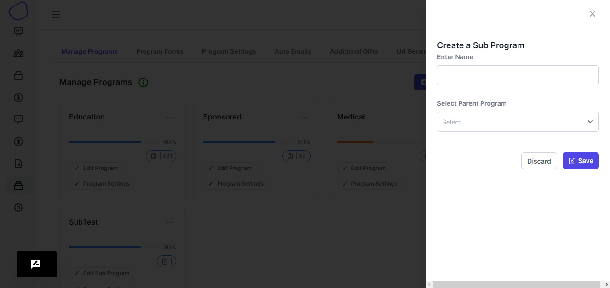

# Manage Programs

1. **Click "Programs".**

.png>)

#### 2. Click "Manage Program".

Once the "Program" sidebar option is clicked, you will be directed to a page listing all the created programs. To manage a specific program, click the cog icon located at the top right of the program card. This will open a drawer with various management options.

.png>)

#### 3. Manage Program Tabs

&#x20; Once the drawer is opened, the following options are listed:

* Settings Tab: This tab allows you to configure and attach settings for the specific program.
* Forms: This is where forms are attached, containing donor and recipient information.
* Emails: This tab enables you to link auto-emails to a particular program.
* Preview: This tab provides a preview of how the system will appear once embedded on a website.
* Edit Program: This tab gives you the ability to edit the program details.&#x20;

.png>)

.png>)

<figure><figcaption></figcaption></figure>

<figure><figcaption></figcaption></figure>

<figure><figcaption></figcaption></figure>

## Steps on How to Manage a Sub-Program.&#x20;

#### 1. Click "Manage Sub Program".

Under your chosen sub-program, you can opt to manage that particular sub-program.

#### 2. Click "Edit Subprogram"

If one wishes to edit a sub-program, this tab allows them to do so

The "dropdown" icon once clicked provides options on how to import data into a program and delete program option as well.

The 'Status Icon' represents the status of the program configurations based on the attachments of forms, program settings and auto emails. If one of them isn't attached, an information icon will appear to indicate that the program isn't configured properly.

If you wish to create a sub-program under the main program, you need to click the 'Create a subprogram' button.

You will be presented with a drawer on the right.&#x20;

<figure><figcaption></figcaption></figure>

You place a name onto it and then choose the parent program that you will attach on the sub program.

