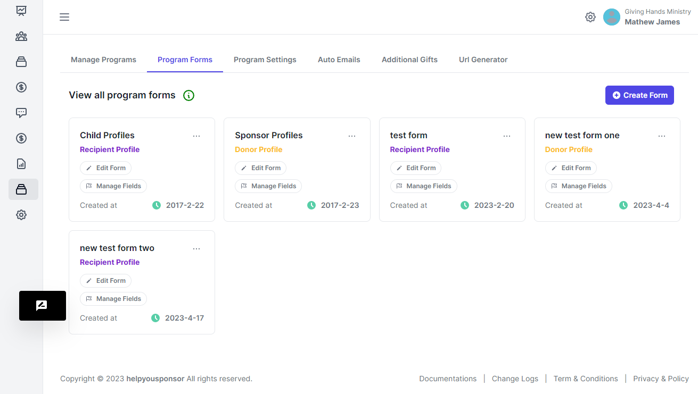
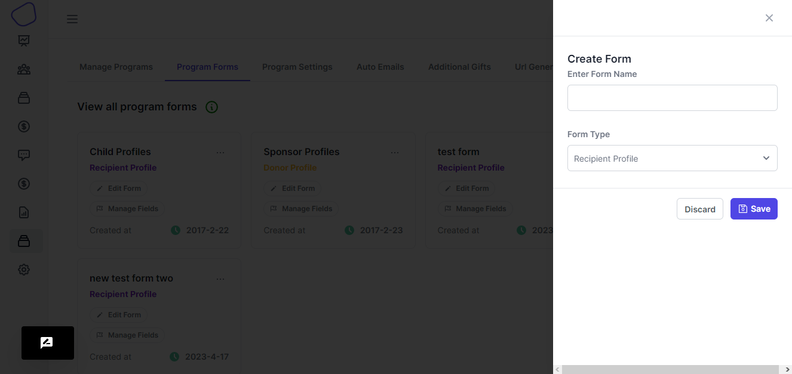
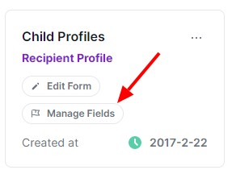
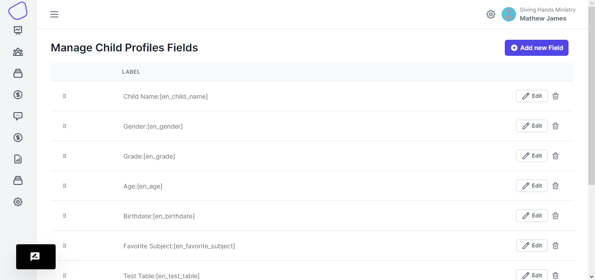
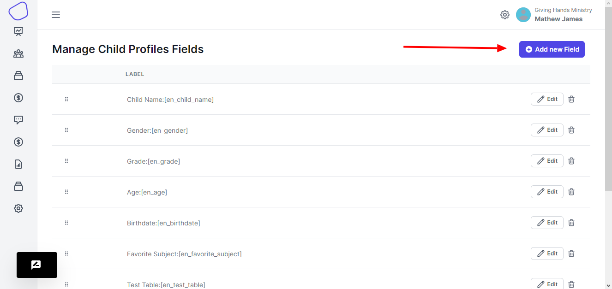
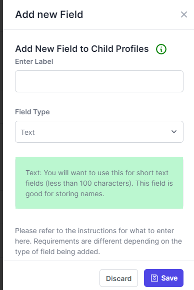
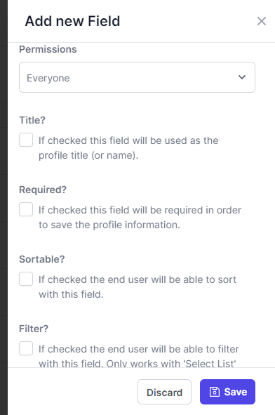

# Program Forms

<figure><figcaption>
program forms
</figcaption></figure>

On this page your presented with the different form that you have created on the account.

**Create a Form**

When you want to create a new form, you click on the `Create Form` button. You will be presented with a right drawer.

<figure><figcaption></figcaption></figure>

On the input form, you place the name that you want to give to the form. Choose the form Type that your creating; this can be `Recipient Profile` , `Donor Profile` and then `Progress Report`

#### Manage Form Fields

After you have created the form, you have to click the&#x20;

<figure><figcaption></figcaption></figure>

You will be redirected to another page that displays the fields on the form.

<figure><figcaption>
form fields
</figcaption></figure>

In the form fields page, you have the option to create and add a new field onto the form.

<figure><figcaption></figcaption></figure>

<figure><figcaption>
create field drawer
</figcaption></figure>

When the drawer loads, you enter the name of the field. Then you choose the Field Type.&#x20;

> Please endeavor to read the instructions in gray that are display for each field type

When you scroll down, you will see more options

<figure><figcaption></figcaption></figure>

The permissions dropdown determines where the data saved onto this fields is available for the whole public to view, whether it's only the admin that view the information.

The other options have hints alongside them to guide you.

**Edit form field**

From the list of form fields, you are able to click the edit button to edit the form field details&#x20;

And then finally you can delete the form fields

#### Edit Form

You can also edit the form detail once you have created it.

You cannot change the form Type when you have already created it, you will have to delete.

