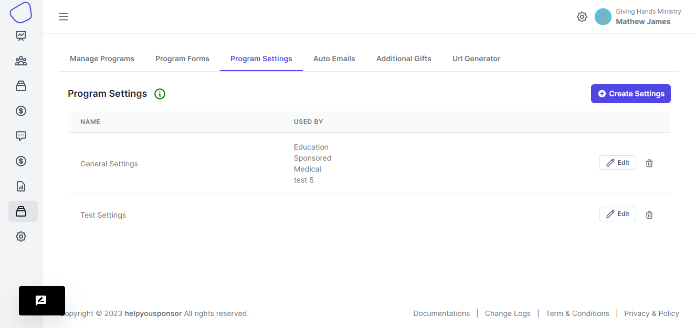
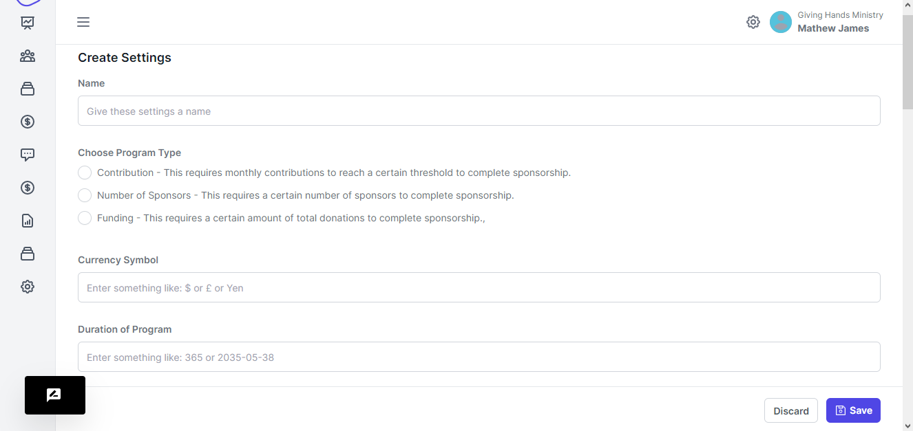
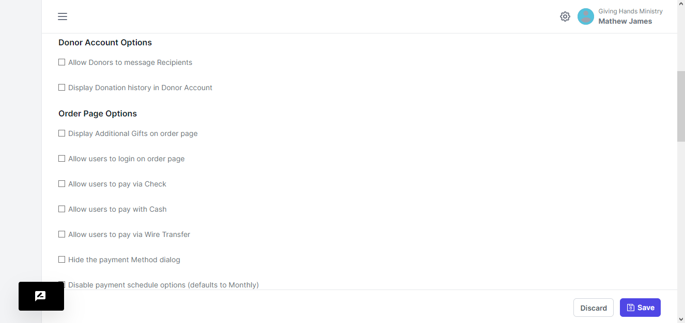
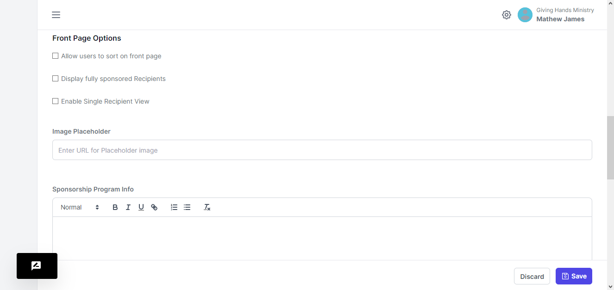
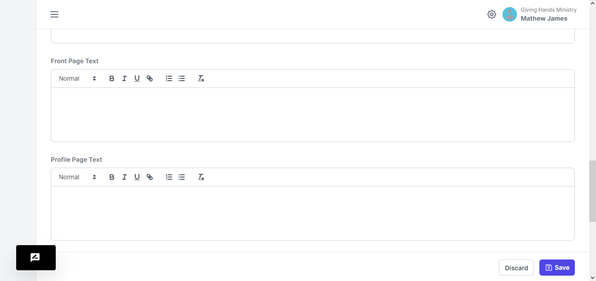
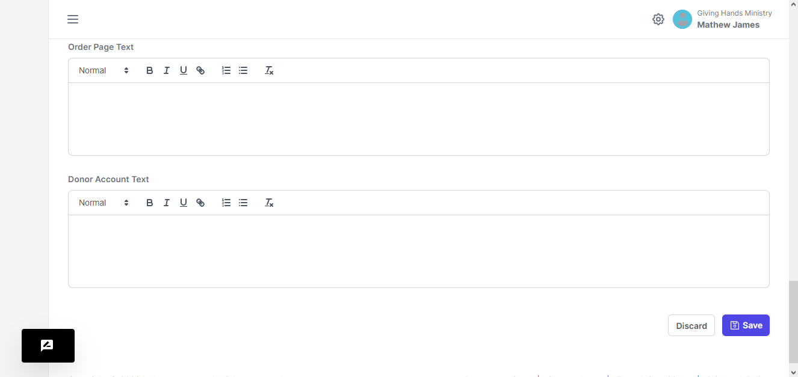

# Program Settings

<figure><figcaption></figcaption></figure>

This page lists the settings that you can attach to any of the programs.

#### Create Settings

When you want to create the settings, you click the `Create Settings` button. You will be taken to a form

<figure><figcaption></figcaption></figure>

You will be required to give a name to the settings.&#x20;

On the program types, you have 3 options to choose from. There hints beside each option.

You can use the Currency Symbol to use. Then you enter the duration of the program that this setting will be placed in.

<figure><figcaption></figcaption></figure>

Donor Account Options are the settings that will be applied when the donor has logged into their profile.

Order Page Options are the settings that will be implemented when the Sponsor has decided to sponsor a recipient.

<figure><figcaption></figcaption></figure>

Front Page Options; these are the settings that are implemented on the front page where the recipients of the program will be displayed.

**Image Placeholder** holds the link to the image that would be displayed on the frontend.

**Sponsorship Program** Info allows you write the description about the program that this setting is going to be attached to.

<figure><figcaption></figcaption></figure>

**Front Page Text** offers you a place to write some extra information that you would want the sponsors to know.

**Profile Page Text** is the text that the donors view once they view the profiles of each recipient

<figure><figcaption></figcaption></figure>

**Order Page Text** is the text displayed on the page where the sponsor confirms his sponsorship

**Donor Account Text** is the text that the sponsors will view when they signin onto their accounts.

