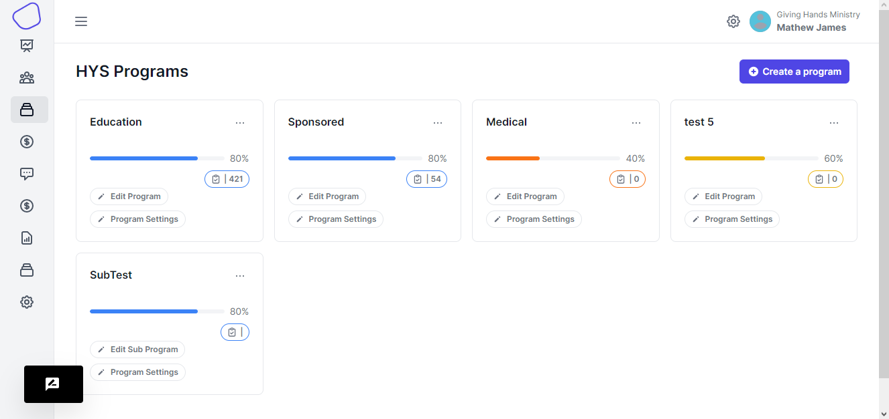
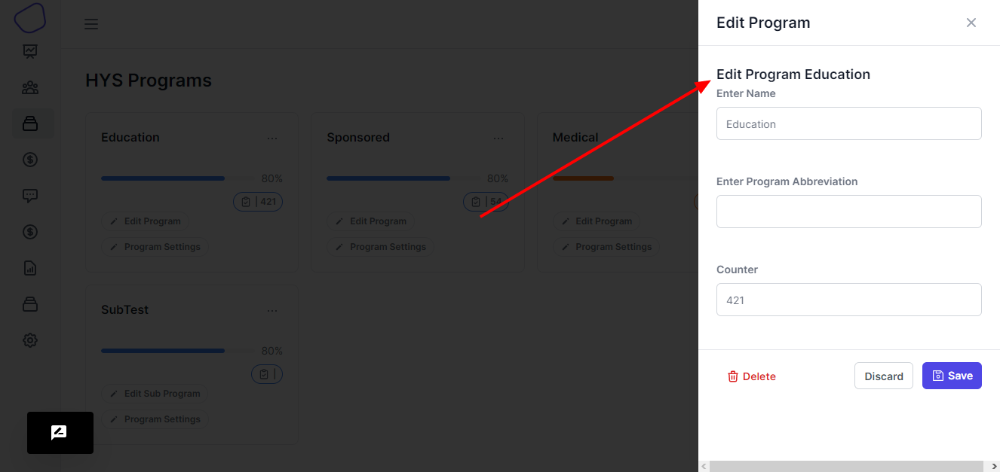

# Programs

A program can be a campaign that your organization wants to run. Each program can have recipients which can be sponsored by a donor.\
For example an education program can have students as recipients. A medical program could have nurses as recipients.

Another use case of a program could be a water well which can have multiple sponsors to one recipient.

This page displays the programs that have been created under your account

<figure><figcaption>
Programs
</figcaption></figure>

On this page, names of the programs that you have created are displayed.

On the cards, you are given options to edit the program details, so when you click on the :pencil2:Edit Program button.&#x20;

<figure><figcaption>
Edit Program Drawer
</figcaption></figure>

You will be presented with right drawer that has the name of the program, the abbreviation which use _optional_ and counter which is the number of recipients in that particular program.

There is an option to view the program settings.

Then you will also see a **Create a Program** button.
