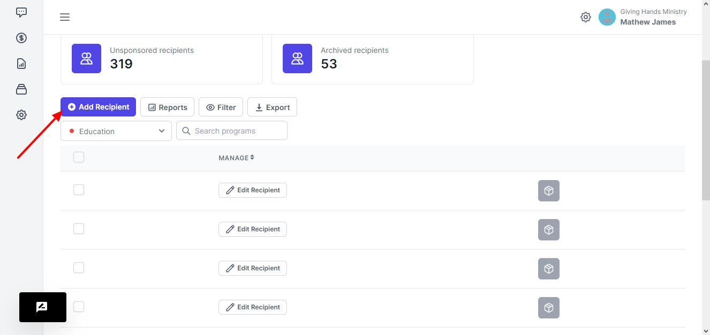
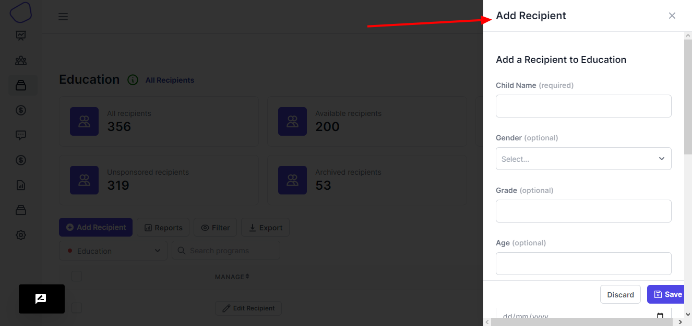

# Add Recipient

<figure><figcaption>
Add Recipient
</figcaption></figure>

When you want to add a recipient onto a program, you click on the add recipient button.

A drawer is brought to you, where you see the fields that you will have to fill in, these fields will be according to the recipient form that you attached to the program.

<figure><figcaption></figcaption></figure>

Some fields will be optional and other will be required. All of this will be depending on how you set the recipient form.
