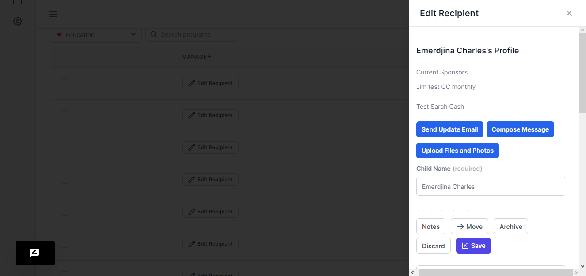
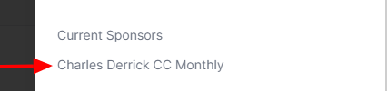
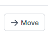
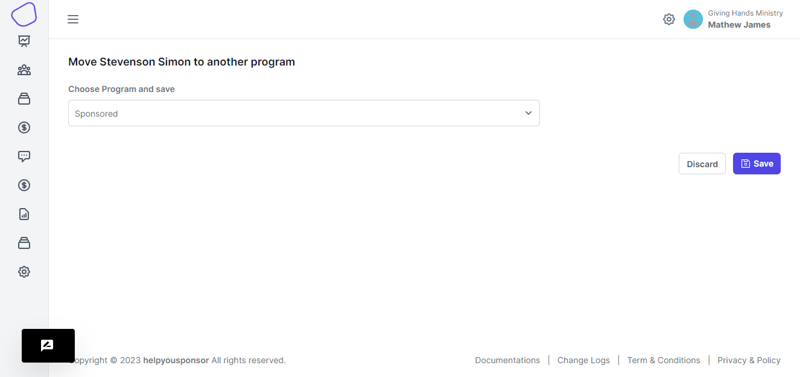

# Edit Recipient

<figure><figcaption></figcaption></figure>

When you choose a recipient and want to edit their details, you click the **Edit Recipient** or **Preview** button

You will be presented with a drawer on the right side. There a couple of features apart from just the form having the recipient's details.

#### List of sponsors

<figure><figcaption></figcaption></figure>

&#x20;These will the sponsors that are sponsoring this recipient

**Send An Update Email**

<figure><figcaption></figcaption></figure>

This email is sent to the sponsor to offer an update on the information about the recipient.

**Compose A message**

<figure><figcaption></figcaption></figure>

Here you compose a message to send to the sponsor about the recipient

**Upload files and images**

Here you are taken to a page where you upload images of that particular recipient

<figure><figcaption></figcaption></figure>

**Notes**

When you want to place notes about the recipient

**Move**

<figure><figcaption></figcaption></figure>

<figure><figcaption></figcaption></figure>

Here you can move the recipient from one program to another

**Archive**

Here the recipient is placed in a status where their not available for sponsoring.

#### Update Recipients thumbnail or profile picture or featured image.

Follow the instructions in the gif below:

<figure><figcaption></figcaption></figure>
