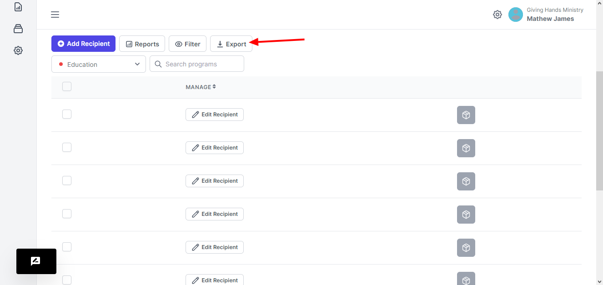

# Export

When you want to export the recipient data or information. You will be able to do so by clicking the Export button.

<figure><figcaption></figcaption></figure>

You will then download a csv format of the table data

> Only the column headers and data available on the view will be exported. You can use the pagination features at the bottom of the table to choose how many records that you want to display
