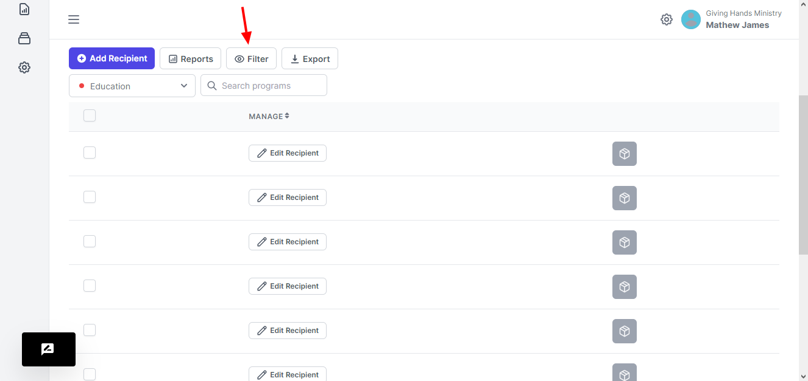
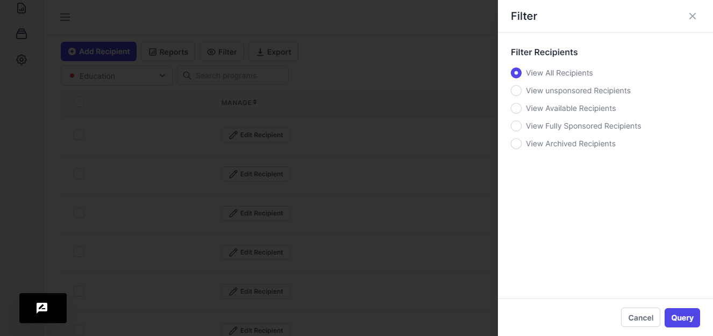

# Filter Program Table

We provide you with the ability to view recipients under a particular status

<figure><figcaption></figcaption></figure>

<figure><figcaption></figcaption></figure>

When you click the Filter button, you will be presented with a drawer on the right.&#x20;

This drawer offers ability to view recipients of a particular status

1. View All Recipients: here you will view all the recipients that are under this particular program.
2. View Unsponsored Recipients: Here you will view the recipients that once had sponsors and the sponsors stopped sponsoring
3. View Available Recipients: Here you will get the recipients that have not been sponsored
4. View Fully Sponsored Recipients: Here you will view all the recipients that are currently being sponsored.
5. View Archived Recipients: Here you will view the recipients that have been placed aside and are not available.
