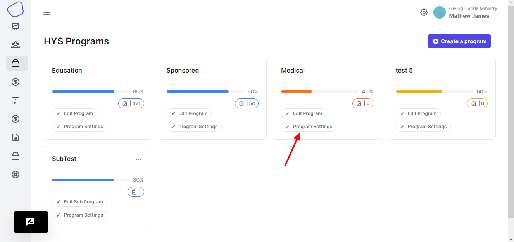

# Program Settings

Once you want to setup the program so that you can be using it, you click the **Program Settings** button.\

<figure><figcaption>
Program settings button
</figcaption></figure>

You will be taken to a program options page

<figure><figcaption>
Program Settings Page
</figcaption></figure>

The page includes a couple of features

**iframe embed code**\
This is the code that you place onto your organization's website. You might need help with a technical person who knows how to setup a website to help you with this step\
When you need more information you can click on the information button for more guidance

<figure><figcaption></figcaption></figure>

*   **View Programs Links**

    These links take you to the pages that display the children under a given program.

<figure><figcaption></figcaption></figure>

We have an infinite scrolling type and a pagination type. You can choose which kind of want to embed on your website

*   **Attach program to General Settings**

    There general settings that you have to define for a program, these settings can be used by all your programs or each program having it's own settings.

    When you can created the General settings, you have to attach a program to those settings.

<figure><figcaption>
Attach Settings
</figcaption></figure>

When you want to attach a setting to a program, you select from the dropdown, and then hit save to attach the settings.

Use the help icon for more details and guidance

* **Attach Recipient Form**\
  Next you have to attach a recipient form, this form contains the fields that will be displayed on the input form when your adding a new recipient onto a program.

<figure><figcaption></figcaption></figure>

*   **Attach Donor Form**

    Here you have to attach a form to the program so that when your adding a sponsor onto a certain program. The fields that will be displayed on the input form will be determined by what donor form you attached to the program.

<figure><figcaption></figcaption></figure>

*   **Attach Auto Emails**

    These are automatic emails that will be sent to either the admin, sponsor when an action takes place concerning the program. These are preset email templates. You only have to customize it to your liking. Some of the actions include a sponsor getting an email when he has been assigned a recipient to sponsor by the admin.

<figure><figcaption></figcaption></figure>

*   **Attach Progress Report Forms**

    Incase you want to generate reports about the program. You create a form and then attach the form to the program

You can create report forms that are about a donor or recipient and then attach the form to either the donors or the recipients.

<figure><figcaption></figcaption></figure>

\
