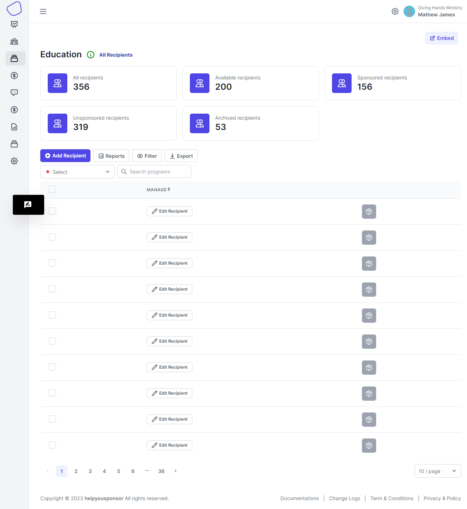
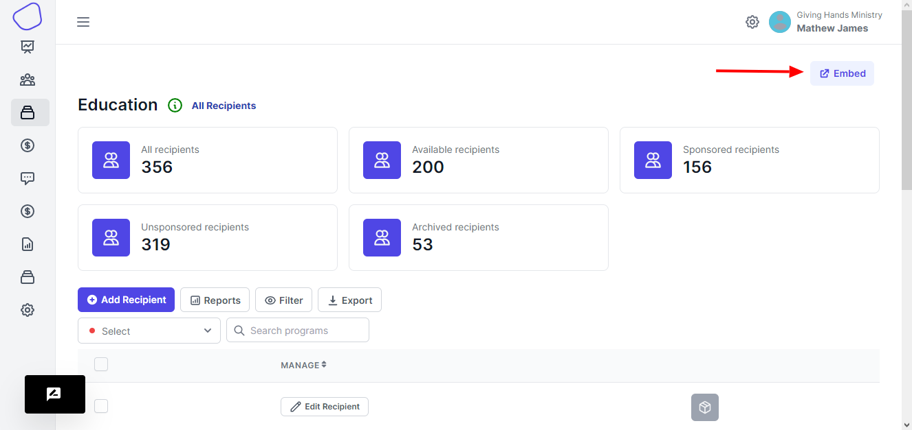
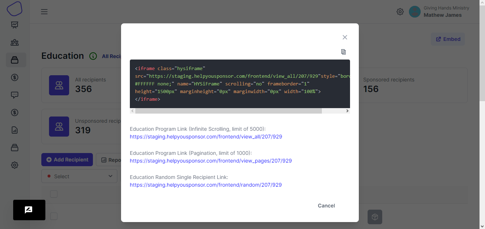
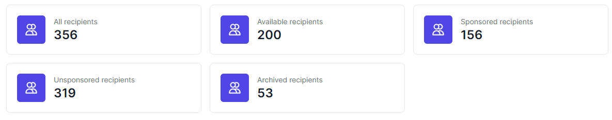

# View Recipients

When you choose to view a program, you will be taken to a page that displays all the recipients in a program

<figure><figcaption>
Recipients Page
</figcaption></figure>

This page offers a variety of features

* **Program embed iframe**

<figure><figcaption></figcaption></figure>

<figure><figcaption></figcaption></figure>

In the dialog, you are presented with an iframe that you can embed onto your website. You will require technical support to embed if you don't know how to do it.

The there link to take you to the page to display the recipients under that program, this can be infinite scroll, pagination.

Then there is a link that displays a random recipient from the program, here you will view the profile page of that recipient

* **Stats on the program**

<figure><figcaption>
program stats
</figcaption></figure>

On the stats, we display the total number of recipients in that program. We display total number of available recipients, these are those that have not been sponsored or have no sponsor currently.&#x20;

Then we have the number of sponsored recipients, here this is the number of recipients that are currently being sponsored.

We have the number of unsponsored recipients, these are recipients that were once under a sponsorship and the sponsor stopped sponsoring them. And then finally we have a number of archived children, these are recipients that have been placed aside.

* **Table tools**

<figure><figcaption></figcaption></figure>

Here the table has buttons like Add Recipient; here you use this button to add a new child onto the program, Reports button; here the button enables you to create customized table column views, Filter button; enables you to filter what data you want to display on the table, Export button; enables you to export the table data

You have search so that you can search recipient, and then finally a dropdown to enable you choose which program you want to view

*   Table

    The table displays the recipients that are under that program.
