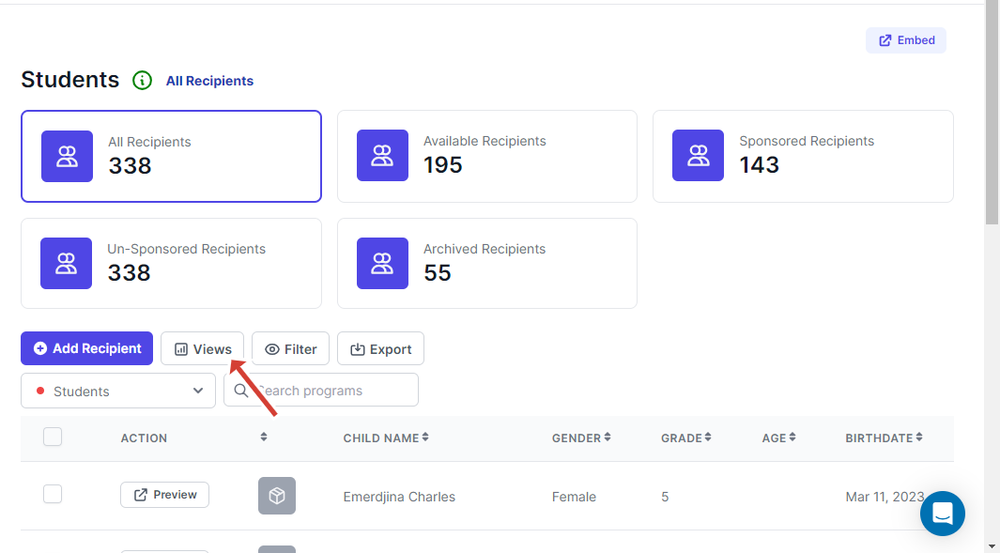
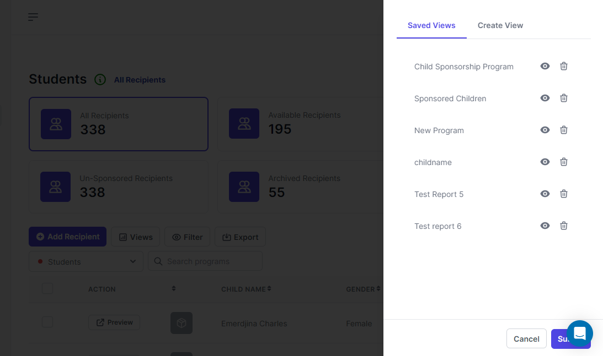
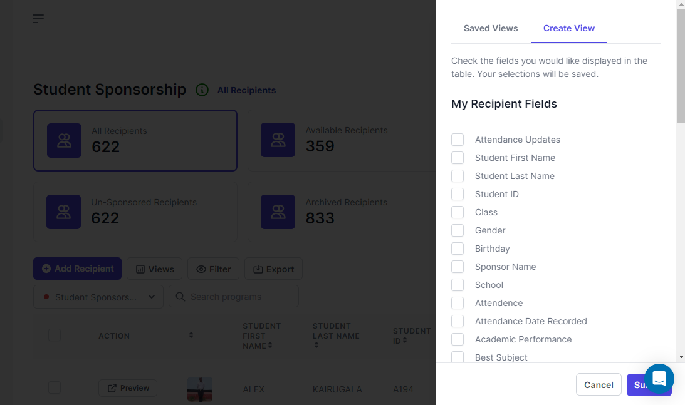
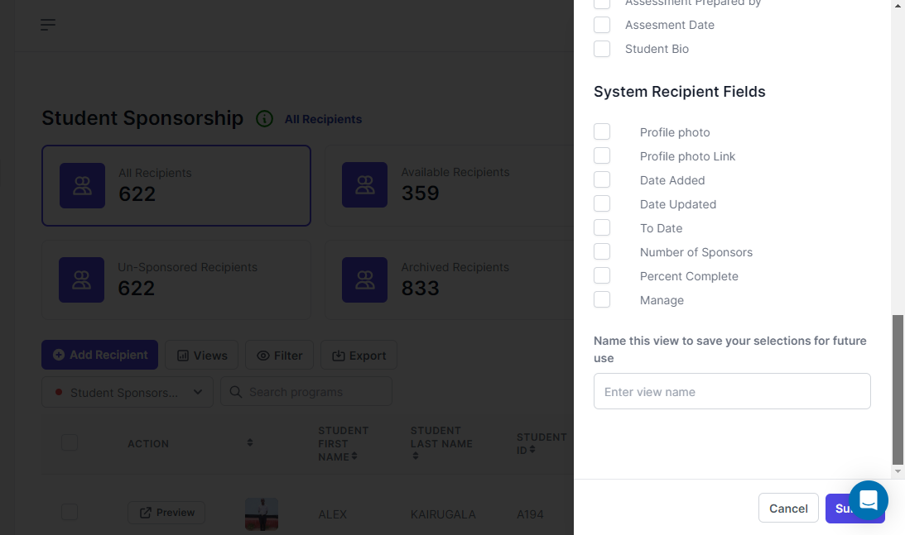

# Views(Formerly known as Reports)

Since the recipient form attached to a program has many fields, by default we do not display all the fields as column headers on the table.

So we offer you a way to choose what column headers that you want to view on the table. This can be done by first clicking the Views button

<figure><figcaption>
Views Button
</figcaption></figure>

This will open a drawer on the right

<figure><figcaption>
Saved Views
</figcaption></figure>

You will see a drawer that has tabs, the first tab is called Saved Views that will contain a list of saved customized table views. You click the :eye:icon to reload the table with the header columns according to the ones that you had described. And then you can also delete the view from the list

The next tab is named Create View

<figure><figcaption>
Create View
</figcaption></figure>

<figure><figcaption></figcaption></figure>

In this form, you will see My Recipients Fields. These are the fields that are from the recipient form that is attached to the program. So you can use the checkbox to select the fields that you want to display on the table

The next is the System Recipient Fields; these fields are from the system by default and you can also choose if you want to display the fields on the table.

After choosing the fields that you want to display on the table as column headers, give the view a name and then hit Submit to save and reload the table.
