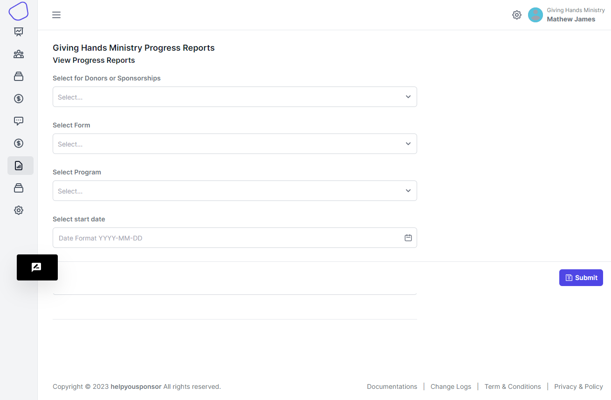
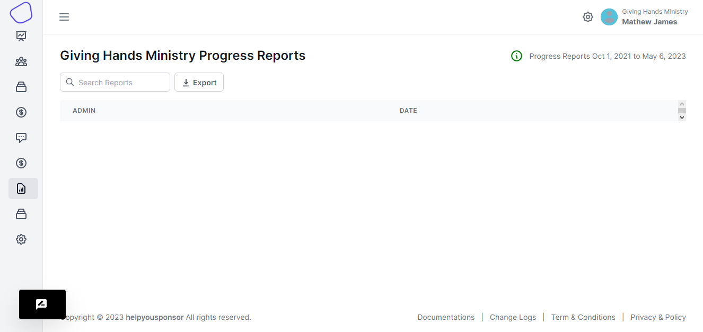

# Progress Reports

When you go to the progress reports page you will be presented with this form.

<figure><figcaption>
progress reports form
</figcaption></figure>

On this form you will have to choose options from the dropdown.

In the `Select for Donors or Sponsorships` dropdown, your required to choose either to view reports from the Donors or the sponsorships

In the `Select Form` you choose which form that you want to view, this will determine the fields that are displayed on the table column headers.

In the `Select Program` you are to choose the program that you want to view from the options

In the `Select start date` and `Select end date` you will be required to choose the date range for the report to be generated.

When your done , then you hit the `Submit` button.

You will be taken to the page where you will be able to view the reports

<figure><figcaption></figcaption></figure>

From that page you will be able to view your reports
