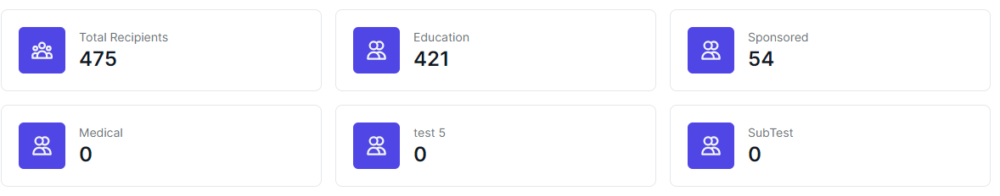

# Sponsorships

In this page, your presented with information about the sponsorships in all your programs.

<figure><figcaption>
sponsorship page
</figcaption></figure>

The sponsorship page has a couple of features

**Stats**

<figure><figcaption>
stats
</figcaption></figure>

Here we display the number of sponsorships that are active under each program. These are the active sponsorships

**Table Tools**

<figure><figcaption>
Table tools
</figcaption></figure>

On the table tools, we have the program dropdown. This allows you to view sponsorships from a particular program.

Search enables you to search for items on the table

**Table data**

On the table, there is information about the sponsorships, these include the information about the sponsor and then also the recipient.

On the manage column, you have the ability to [Edit a Recipient](programs/edit-recipient.md)&#x20;

**Edit a Donor**

When you want to edit the details of the donor on a sponsorship, you click the Edit Donor button and you will be presented with a Edit Donor Drawer on the right

<figure><figcaption>
Edit Donor Profile
</figcaption></figure>

You can change the values on the form and then hit Submit to save.

> The form contains some system fields and also some fields from the donor form that you used when creating the donor&#x20;

Also you can use the pagination features to display a given number of records on the table
